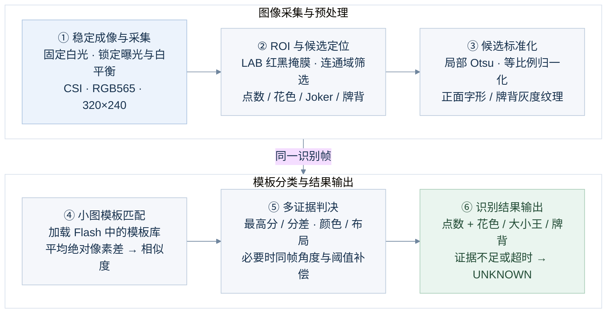

# 扑克牌图像识别系统技术路径

## 技术框图

采用两行三列布局，按编号 1～6 阅读，便于放入一页 16:9 PPT。修改 Mermaid 节点文字即可编辑框图。



调试入口 `recognize_cards_hybrid.py` 每 3 秒自动识别，通过 USB 输出结果；部署入口 `main_standalone.py` 由 P6 触发，通过 UART3 返回结果。`UNKNOWN` 表示证据不足，当前未实现无牌检测。

## Flash 最终存储目录

独立运行版本将 `main_standalone.py` 复制为 `/flash/main.py`。相机参数与模板均存储在内部 Flash，最终部署结构如下：

```text
/flash/
├── main.py                       # 独立运行入口，来源：main_standalone.py
├── cards_fast_config.py           # 公共相机、存储与模板配置
├── cards_hybrid_core.py           # 定位、标准化、匹配与判决算法
└── cards_fast_v1/
    ├── camera.json                # 曝光、增益、RGB白平衡等标定参数
    └── templates/
        ├── rank/                  # A、2～10、J、Q、K点数模板
        │   ├── *.pgm              # 32×48归一化图像
        │   └── *.json             # 同名模板元数据
        ├── suit/                  # heart、diamond、club、spade花色模板
        │   ├── *.pgm              # 32×32归一化图像
        │   └── *.json
        ├── joker/                 # 红/黑王字形模板，类别由颜色区分
        │   ├── *.pgm              # 40×80归一化图像
        │   └── *.json
        └── back/                  # 牌背纹理模板
            ├── *.pgm              # 48×64灰度图像
            └── *.json
```

每个模板的 PGM 和 JSON 必须同名配对，例如 `A_00.pgm` 与 `A_00.json`。采集脚本和 IDE 调试识别脚本可保留在电脑端；通过 IDE 运行时，公共配置与核心模块仍须部署到板端。

`camera.json.new`、`camera.json.bak` 是校准更新时生成的临时恢复文件，不属于正常完成后的常驻目录，也不需要手动创建。

