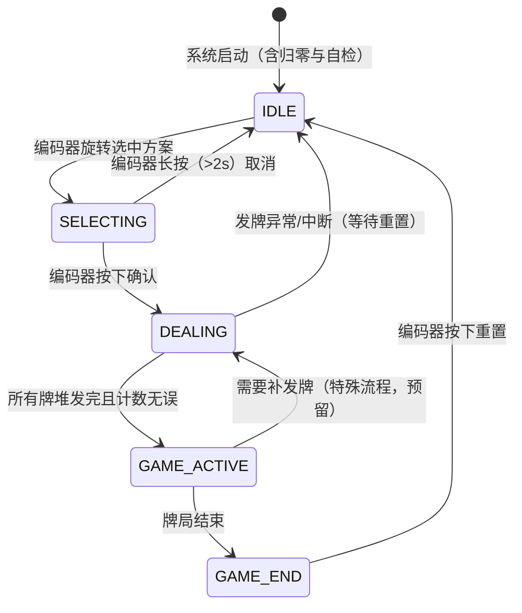
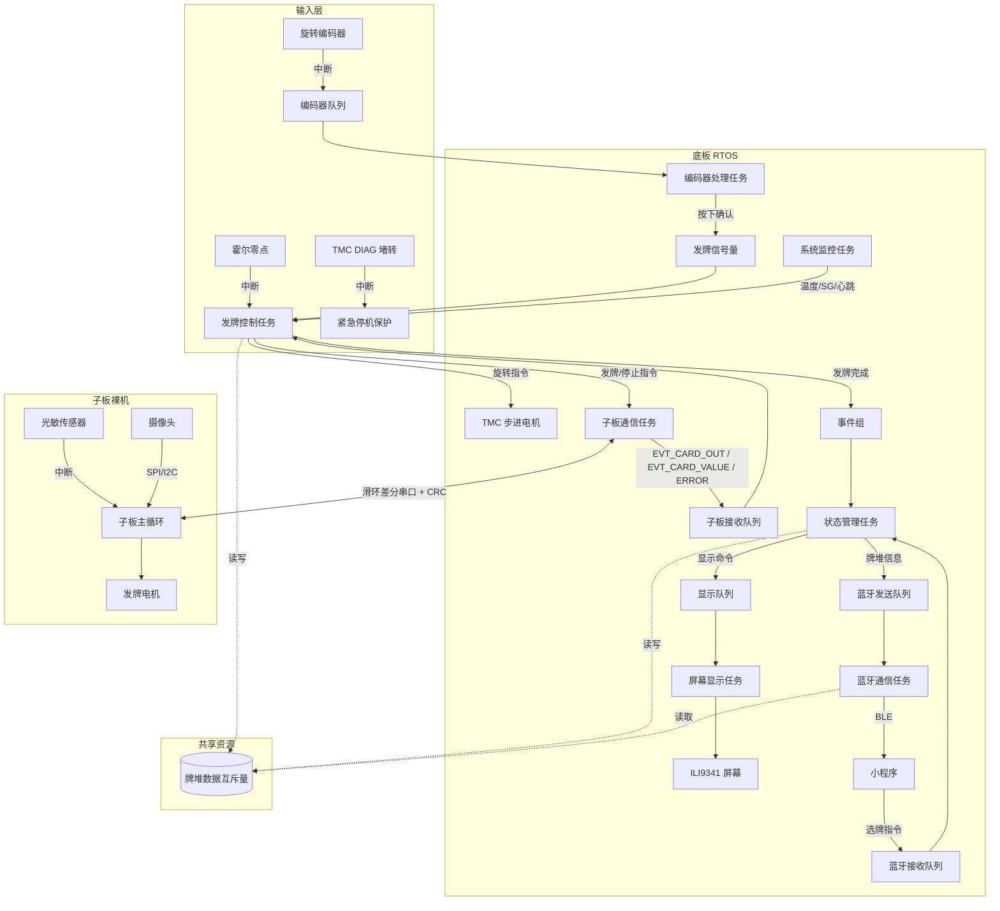

# 发牌机整体架构 v2（底板 RTOS + 子板裸机）

> 版本：v2.0  
> 日期：2026-08-23  
> 来源：整合《发牌机大致架构 v1》、《与 AI 的部分对话》、《ESP32-S3-WROOM-1-N16R8 底板软件开发交接指南》  
> 状态：草稿，**待硬件核对**。交接指南明确提示其内容由 AI 根据原理图整理、可能有错，本文涉及引脚/电气参数处均需以原理图和器件数据手册为准。

## 版本变更摘要

v2 在 v1 的框架上做整合性修订，**不推翻 v1 的主体结构**（状态机、任务集合、ITC 机制、异常处理框架均保留）。主要动作：

1. 明确子板为**裸机（超级循环 + 中断）**架构，不再按 RTOS 任务描述子板逻辑（此前与 AI 对话已达成此结论，v1 中“子板视为外设”的前提与此一致）。
2. 新增底板与子板之间的**通信协议章节**（主从式滑环差分串口、CRC、每张牌实时上报）。
3. 落地《底板交接指南》的硬件约束：IO 映射、电源架构、TMC2209 开发规范、霍尔两段式归零、屏幕 + SD 总线复用、整机故障保护。
4. 保留 v1 的 5 状态状态机与全部 ITC 对象，仅调整个别队列/信号量的生产来源。

与 v1 的逐项差异见 [architecture_v2_diff.md](architecture_v2_diff.md)；子板详细设计见 [subboard_architecture.md](subboard_architecture.md)。

---

## 一、系统概述与硬件架构

### 1.1 系统组成

- **底板**：ESP32-S3-WROOM-1-N16R8，负责整体逻辑控制：底座转盘步进电机、屏幕 + SD 卡、旋转编码器、霍尔零点传感器、摄像头补光、蓝牙（ESP32-S3 内置 BLE）与小程序通信、滑环差分串口与子板通信。
- **子板（上层模组）**：负责发牌电机、光敏传感器、摄像头（视觉识别）；被视为“带反馈的执行器”，预处理后通过滑环差分串口将信息实时传回底板统一处理。
- **滑环**：连接底板与上层模组，提供 12V / 6V / 5V 供电通道 + 差分串口 RING_UART±，各路电源串联自恢复保险丝并带 ESD 防护。

### 1.2 硬件部件总览（基于 v1 表格更新）

| 部件 | 所属板 | 连接方式 | 功能 |
|------|--------|----------|------|
| 底座转盘电机（步进） | 底板 | TMC2209 驱动（STEP/DIR/ENN + 单线 UART） | 控制转盘旋转到指定牌堆，支持细分、静音、StallGuard 堵转检测 |
| 发牌电机 | 子板 | GPIO/PWM（6V 直流电机） | 从牌堆发出一张牌 |
| 摄像头 | 子板 | SPI/I2C（视觉模组） | 发牌时记录牌面信息（花色、点数） |
| 光敏传感器 | 子板 | GPIO 中断 | 检测牌是否成功发出、计数 |
| 屏幕 | 底板 | SPI（ILI9341，320×240） | 显示方案、状态、牌面 |
| SD 卡 | 底板 | SPI（与屏幕共用总线，独立片选） | 存储牌照图片、整机配置文件 |
| 旋转编码器 | 底板 | GPIO（A/B 相 + 按键） | 选择方案、确认发牌、重置 |
| 霍尔零点传感器 | 底板 | GPIO（A3144，集电极开路） | 转盘上电绝对归零、运行中失步校准 |
| 摄像头补光 LED | 底板 | GPIO/PWM | 暗光时牌照识别补光 |
| 蓝牙 | 底板 | ESP32-S3 内置 BLE | 与小程序通信（选牌、查询、状态上报） |
| CH340 调试串口 | 底板 | UART0（TXD0/RXD0） | 固件下载、运行日志、上位机指令交互 |

> 注：交接指南提到底板另有 SW3“2.4G 自定义功能按键”，可预留为自定义功能入口，具体用途待定。

### 1.3 底板 ESP32-S3 IO 映射表

> ⚠️ 以下映射来自交接指南，**必须与底板原理图逐项核对后再用于开发**。交接指南自身已警告可能存在错误（例如其“闲置 IO”列表与映射表对 IO10 的归属不一致，见文末待核对清单）。

| IO 引脚 | 硬件网络名 | 外设功能定义 | 方向 | 补充说明 |
|---------|------------|--------------|------|----------|
| IO0 | BOOT | 程序下载启动按键 | 输入 | 下拉至 GND，下载专用 |
| IO1 | ROT1 | A3144 霍尔零点传感器 | 输入 | 必须开启内部上拉 `INPUT_PULLUP` |
| IO4 | DRIVER_STEP | TMC2209 步进脉冲 | 输出 | 脉冲频率控制转速 |
| IO5 | DRIVER_DIR | 步进方向 | 输出 | 高低电平切换正反转 |
| IO6 | DRIVER_ENN | 驱动使能 | 输出 | 高电平断电停机，低电平正常工作 |
| IO7 | DRIVER_DIAG | TMC 硬件堵转检测 | 输入 | 堵转时电平翻转，外部中断紧急停机 |
| IO15 | DRIVER_INDEX | 电机一圈索引脉冲 | 输入 | 每完整一圈 1 个脉冲，用于失步校准 |
| IO16 | DRIVER_STDBY | 驱动休眠控制 | 输出 | 低电平唤醒，高电平休眠 |
| IO17 | MCU_TX | TMC2209 单线 UART 发送 | 输出 | 串联 1K 电阻连接 PDN_UART 节点 |
| IO18 | MCU_RX | TMC2209 单线 UART 接收 | 输入 | 1K 电阻靠近 TMC 侧，不可接 MCU 侧 |
| IO8 | EC11_A | 编码器 A 相 | 输入 | 内部上拉，硬件自带 100pF 消抖 |
| IO19 | EC11_B | 编码器 B 相 | 输入 | 正交解码区分方向 |
| IO10 | EC11_SW | 编码器按键 | 输入 | 按下为低电平，软件 5~10ms 消抖 |
| IO9 | LED | 指示灯 / 补光预留使能 | 输出 | 高电平点亮 |
| IO12 | SCK | SPI 公共时钟（屏幕 + SD） | 输出 | 屏幕、SD 共用 |
| IO13 | SDI(MOSI) | SPI 数据输出 | 输出 | 屏幕、SD 共用 |
| IO14 | DC | TFT 数据/命令选择 | 输出 | 低=寄存器指令，高=图像数据 |
| IO21 | RESET | TFT 硬件复位 | 输出 | 低电平复位，高电平正常 |
| IO47 | CS | TFT 片选 | 输出 | 刷新时拉低 |
| IO48 | SD_CS | SD 卡片选 | 输出 | 读写 SD 时拉低 |
| IO45 | SD_MISO | SPI 数据输入（SD 卡） | 输入 | SD 回传数据专用 |
| IO37 | IO_EXT3 | 滑环预留外部 IO3 | 双向 | 上层设备拓展备用 |
| IO38 | IO_EXT2 | 滑环预留外部 IO2 | 双向 | 上层设备拓展备用 |
| IO39 | IO_EXT1 | 滑环预留外部 IO1 | 双向 | 上层设备拓展备用 |
| IO42 | RING_UART+ | 滑环差分串口正极 | UART 收发 | 与上层通信，长线易受干扰 |
| IO41 | RING_UART- | 滑环差分串口负极 | UART 收发 | 差分抗干扰，必须加数据校验 |
| TXD0 | TXD0 | CH340 调试串口发送 | 输出 | 日志、上位机指令 |
| RXD0 | RXD0 | CH340 调试串口接收 | 输入 | 接收调试指令 |

### 1.4 电源架构

| 电源轨 | 转换电路 | 供电对象 |
|--------|----------|----------|
| 6V | MP1584EN（7.4V→6V） | 上层发牌/洗牌直流电机（经滑环输出） |
| 5V | MP1584EN（7.4V→5V） | A3144 霍尔、EC11、摄像头补光 LED、CH340、滑环 5V、Type-C 调试口 |
| 12V | XL6009（7.4V→12V） | 仅 TMC2209 步进驱动（滑环对外输出 12V） |
| 3.3V | AMS1117-3.3（5V→3.3V） | 主控内核、SPI 屏幕、SD 卡、3.3V 信号 IO、霍尔上拉 |

> Micro USB 调试供电口仅允许离线调试霍尔、编码器、光电传感器，**禁止**为视觉模组和满载电机供电（二极管压降后仅 4.6~4.7V）。

---

## 二、软件架构总览

### 2.1 总体分层

| 板块 | 架构选择 | 理由 |
|------|----------|------|
| 底板 | **FreeRTOS（Arduino 框架，PlatformIO）** | 任务多且并发复杂：蓝牙、编码器、屏幕、状态机、子板通信，需 RTOS 解耦 |
| 子板 | **裸机超级循环 + 中断** | 串行流水线逻辑，无多优先级并发需求；响应快、资源省、调试直观（详见子板架构文档） |
| 板间通信 | 主从式差分串口（滑环） | 底板为主、子板为从；CRC 校验、短包分帧、掉线超时保护 |

### 2.2 职责边界（v2 明确分工）

| 层面 | 归属 | 说明 |
|------|------|------|
| 物理层异常（光敏超时、卡牌） | **子板**检测并立即上报 | 子板实时监控传感器，第一时间发 `EVT_ERROR_CARD_JAM`，不做重试决策 |
| 机械层异常（发牌电机堵转电流） | **子板**检测并立即上报 | 驱动电路检测电流异常，底板决定是否停止/急停 |
| 机械层异常（底座 TMC 堵转、过热、霍尔失效） | **底板**检测 | DIAG 中断、温度轮询、归零超时保护 |
| 业务层决策（漏发/多发、重发、停止） | **底板** | 底板收到实时事件后自行累加计数，按状态机决定重发或报警 |
| 整副牌堆数据上传小程序 | **底板** | 底板逐张接收并拼装，整局结束后统一经蓝牙上传 |

> 关键通信原则：**子板 → 底板逐张实时上报，底板 → 小程序统一上传**。

---

## 三、底板任务划分（RTOS）

### 3.1 任务列表

| 任务名 | 优先级 | 核心绑定建议 | 职责 | 周期/触发方式 |
|--------|--------|--------------|------|----------------|
| 蓝牙通信任务 | 高 (3) | 任意 | 接收小程序指令（选牌、查询状态），发送牌堆信息、发牌状态 | 队列阻塞 |
| 子板通信任务 | 中 (2) | 固定核心0 | 底板与子板数据收发：指令下发、事件解析（光敏计数、牌面识别、异常上报） | 队列 + 串口中断 |
| 发牌控制任务 | 中高 (2) | 固定核心1 | 执行发牌主流程：锁存方案 → 旋转到目标堆 → 下发发牌指令 → 等待子板实时事件 → 更新牌堆数据与进度 | 信号量/队列 |
| 编码器处理任务 | 中 (2) | 任意 | 编码器方向/按下/长按，选择方案、确认、重置 | 中断 + 队列 |
| 屏幕显示任务 | 低 (1) | 任意 | 事件驱动刷新屏幕（菜单、进度、牌面、结果、错误） | 队列阻塞（非轮询） |
| 状态管理任务 | 低 (1) | 任意 | 维护全局状态机，协调任务间状态切换 | 事件组 |
| 系统监控任务（新增） | 低 (1) | 任意 | 周期读取 TMC 温度 / SG_RESULT、检测滑环通讯心跳、LED 状态指示 | 定时器周期触发 |

> 与 v1 的对应关系：v1 中“光敏检测任务/子板、发牌控制任务/子板、摄像头采集任务/子板”三条不再属于底板 RTOS，其职责由子板裸机状态机承担，底板侧只保留“子板通信任务 + 发牌控制任务”作为编排入口。详见差异文档。

### 3.2 优先级设计依据（保留 v1）

| 优先级 | 任务 | 理由 |
|--------|------|------|
| 高 (3) | 蓝牙通信 | 及时响应用户操作（选牌、远程控制） |
| 中高 (2) | 发牌控制 | 核心功能，涉及电机时序，需保证连续性 |
| 中 (2) | 编码器、子板通信 | 用户交互与数据采集，及时但不苛刻 |
| 低 (1) | 屏幕显示、状态管理、系统监控 | UI 与巡检不紧急，避免占用 CPU 影响实时控制 |

### 3.3 任务触发方式统一表（来自与 AI 的对话）

| 任务名 | 触发方式 | 等待对象 | 触发时机 | 触发来源 |
|--------|----------|----------|----------|----------|
| 编码器处理任务 | 中断触发 | `xEncoderQueue` | 旋转或按下（硬件中断） | 用户物理操作 |
| 发牌控制任务 | 同步触发 | `xDealSemaphore` | 编码器确认发牌后由编码器任务 Give | 用户确认操作 |
| 子板通信任务 | 串口中断 + 队列 | 接收队列 + 发送队列 | 子板上报事件，或底板下发指令 | 子板硬件事件 / 发牌任务请求 |
| 蓝牙通信任务 | 队列阻塞 | 接收/发送队列 | 小程序指令到达，或状态管理任务有数据待发 | 小程序操作 / 系统状态上报 |
| 状态管理任务 | 事件组 | `xStateEventGroup` | 发牌完成、选牌完成、牌局结束等 | 其他任务执行完毕 |
| 屏幕显示任务 | 队列触发 | `xDisplayQueue` | 任何需要屏幕更新的事件发生 | 所有其他任务均可触发 |
| 系统监控任务 | 定时器周期 | 软件定时器 | 周期巡检 TMC 温度 / SG / 通讯心跳 | 定时器 |

设计原则：

1. 每个任务只有一种主要触发方式（等队列或等信号量，不混用）。
2. 永久阻塞为常态，**超时阻塞只用于异常检测**（如子板通信等待超时）。
3. 状态管理任务只做协调，不直接执行业务。
4. 屏幕显示任务“只展示、不决策”，完全被动响应。

---

## 四、任务间通信与同步机制（ITC）选型

### 4.1 队列（数据传递）

| 队列名 | 数据内容 | 生产者 | 消费者 | 容量 |
|--------|----------|--------|--------|------|
| `xEncoderQueue` | 编码器事件（方向、按下、时间戳） | 编码器 ISR | 编码器处理任务 | 10 |
| `xBluetoothRxQueue` | 小程序指令（选牌、查询） | 蓝牙任务（接收） | 状态管理任务 | 10 |
| `xBluetoothTxQueue` | 待发送数据（牌堆信息、状态） | 状态管理任务 | 蓝牙任务（发送） | 20 |
| `xSubboardRxQueue` | 子板回传事件（光敏计数、牌面识别、异常） | 子板通信任务 | 发牌控制任务 | 20 |
| `xCameraQueue` | 牌面识别结果（牌号、花色） | **子板通信任务**（解析 `EVT_CARD_VALUE`） | 发牌控制/状态管理任务 | 20 |
| `xDisplayQueue` | 屏幕显示命令（见附录 A） | 状态管理/发牌/编码器/蓝牙任务 | 屏幕显示任务 | 5 |

> 调整说明：v1 中 `xCameraQueue` 由“摄像头采集任务（子板）”生产；v2 中摄像头识别在子板完成，底板由子板通信任务解析协议事件后入队，对外接口不变。

### 4.2 信号量（事件同步）

| 信号量 | 类型 | 初始值 | 用途 |
|--------|------|--------|------|
| `xDealSemaphore` | 二值 | 0 | 发牌准备就绪，通知发牌控制任务开始 |
| `xCardDetectedSem` | 二值 | 0 | 子板通信任务解析到 `EVT_CARD_OUT` 后 Give，发牌控制任务继续 |
| `xDeckReadySem` | 二值 | 0 | 子板就绪 / 识别完成上报后 Give，通知底板取数据 |

> 调整说明：v1 中光敏信号由底板直连中断触发；v2 中光敏在子板侧，信号量触发源改为“子板通信任务解析协议事件后 Give”，发牌控制任务的等待语义不变。

### 4.3 互斥量（保护共享资源）

| 互斥量 | 保护对象 | 原因 |
|--------|----------|------|
| `xDeckDataMutex` | 牌堆数据（牌面信息、已发数量） | 发牌写入、蓝牙读取、屏幕显示可能同时访问 |
| `xStateMutex` | 全局状态变量 | 状态管理任务写入，其他任务查询 |

### 4.4 事件组（多条件等待）

| 事件组 | 用途 |
|--------|------|
| `xStateEventGroup` | 通知各任务系统状态变化（发牌完成、牌局结束、重置等），支持“多条件同时满足”等待 |

---

## 五、状态机设计

### 5.1 状态定义（保留 v1）

| 状态 | 含义 | 可执行操作 |
|------|------|------------|
| IDLE | 待命状态 | 编码器选择方案，屏幕显示方案列表 |
| SELECTING | 已选中方案，等待确认 | 编码器切换方案，按下确认发牌 |
| DEALING | 发牌中 | 底座旋转、子板发牌、光敏检测、摄像头识别 |
| GAME_ACTIVE | 牌局进行中 | 小程序选牌、底板屏幕显示、记录操作（不使用编码器/发牌电机/光敏/摄像头） |
| GAME_END | 牌局结束 | 显示结果，编码器重置回到 IDLE |

### 5.2 状态转移图



### 5.3 状态转移条件详细说明（保留 v1）

| 转移 | 触发条件 | 动作 |
|------|----------|------|
| IDLE → SELECTING | 编码器旋转（每格一档） | 高亮显示不同方案（如德州扑克、斗地主、桥牌） |
| SELECTING → DEALING | 编码器按下 | ① 锁存方案参数 ② 启动发牌任务 ③ 更新屏幕为“发牌中” |
| DEALING → GAME_ACTIVE | 所有牌堆发完且光敏计数无误 | ① 上传牌堆信息到小程序 ② 屏幕显示“等待选牌” |
| DEALING → IDLE | 发牌异常（漏发/多发/卡牌） | ① 显示错误信息 ② 等待编码器重置 |
| GAME_ACTIVE → GAME_END | 所有牌被选完/牌局结束 | ① 屏幕显示结果 ② 等待重置 |
| GAME_END → IDLE | 编码器按下 | ① 清空牌堆数据 ② 复位所有状态 ③ 重置屏幕 |
| SELECTING → IDLE | 编码器长按（>2 秒） | 取消选择，回到待命 |
| GAME_ACTIVE → DEALING | 需要补发牌（特殊流程） | 预留，待方案细化后启用 |

---

## 六、任务间数据流示意图



---

## 七、底板与子板通信协议（v2 新增）

### 7.1 物理层与可靠性要求

- 物理通道：滑环串口（IO42/IO41，**当前实现按 2 线普通 UART 处理**，RX/TX 各一根；若板上配有差分收发器，对本层透明）。
- 电机启停电磁干扰强，**所有数据包必须带 CRC 校验**，校验失败直接丢弃并触发重传。
- 单次数据包长度不宜过长，分小段发送，降低干扰丢包概率。
- 增加通讯掉线超时保护：长时间无应答时暂停发牌旋转动作，等待链路恢复。

### 7.2 帧格式草案

```
帧头(0xA5) | 类型(1B) | 长度(1B) | 数据(nB) | CRC(1B) | 帧尾(0xAA)
```

- 底板 → 子板为**命令**，子板 → 底板为**事件**。
- 具体帧定义待子板硬件定型后与 `subboard_architecture.md` 中的协议草案对齐。

### 7.3 命令/事件分类（草案）

| 方向 | 类型 | 内容 |
|------|------|------|
| 底板 → 子板 | `CMD_DEAL_START` | 启动发牌电机发一张牌 |
| 底板 → 子板 | `CMD_STOP` | 停止电机 / 急停 |
| 底板 → 子板 | `CMD_STATUS_QUERY` | 查询子板状态 |
| 底板 → 子板 | `CMD_SELF_TEST` | 触发子板自检 |
| 子板 → 底板 | `EVT_READY` | 上电自检完成，等待命令 |
| 子板 → 底板 | `EVT_CARD_OUT` | 光敏检测到一张牌发出（成功标志） |
| 子板 → 底板 | `EVT_CARD_VALUE` | 牌面识别结果（牌序号、花色、点数） |
| 子板 → 底板 | `EVT_DEAL_DONE` | 单张发牌流程完成 |
| 子板 → 底板 | `EVT_ERROR_CARD_JAM` | 光敏超时 / 卡牌（物理层异常，立即上报） |
| 子板 → 底板 | `EVT_ERROR_MOTOR_STALL` | 发牌电机堵转（如支持电流检测） |
| 子板 → 底板 | `EVT_ERROR_CAM_FAIL` | 摄像头识别失败（标记未知牌） |

### 7.4 实时上报与统一上传原则

1. **子板 → 底板（物理层）**：每发一张牌实时上报一次，数据包含 `{牌序号, 牌面值, 成功/失败标志}`；子板不缓存整副牌数据。
2. **子板异常**：遇到卡牌超时立即上报 `EVT_ERROR_CARD_JAM`，不再继续后续动作。
3. **底板（业务层）**：收到实时事件后更新内存中的牌堆数组，并发送屏幕显示命令。
4. **底板 → 小程序（业务层）**：整局发牌结束后，底板把拼装好的完整牌堆列表一次性上传小程序。

---

## 八、异常处理机制

### 8.1 v1 已有异常（保留，分工调整）

| 异常 | 处理方式 |
|------|----------|
| 光敏超时 | 子板在发牌电机启动后 500ms 内未检测到牌 → 立即上报 `EVT_ERROR_CARD_JAM`；底板标记“疑似漏发”，重试一次，仍失败则暂停并报警 |
| 摄像头识别失败 | 子板标记“未知牌”继续下一张；底板整局结束后向小程序报告异常 |
| 蓝牙断连 | 检测到断连 → 暂停远程功能，本地仍可操作，等待重连后补发状态 |
| 发牌电机堵转 | 子板通过电流检测（如有）或超时判断 → 立即上报，底板决定停止并进入错误状态 |
| 编码器输入抖动 | ISR 中 5ms 消抖，队列只记录有效事件 |

### 8.2 新增硬件保护（来自底板交接指南）

| 保护项 | 机制 | 动作 |
|--------|------|------|
| 底座步进堵转 | `DRIVER_DIAG`（IO7）硬件中断 | 立刻拉高 `DRIVER_ENN` 关闭驱动断电，同步读取 `SG_RESULT` 记录堵转负载，屏幕告警 |
| 驱动过热 | 系统监控任务定时读取 TMC 温度寄存器 | 超过阈值直接停机，禁止继续旋转 |
| 零点传感器失效 | 归零流程步数超时保护 | 锁死电机，禁止任何旋转动作，屏幕上报故障代码 |
| 滑环通讯掉线 | 通讯超时阈值 | 暂停发牌流程，等待链路恢复 |
| 步进失步校准 | `DRIVER_INDEX`（IO15）每圈脉冲 | 每次经过一圈脉冲时对比理论步数，自动修正计数器 |
| 电机干扰防护 | 电机启停瞬间屏蔽传感器中断、多次采样取平均、串口 CRC | 防止霍尔/编码器误触发与串口乱码 |

---

## 九、启动顺序

### 9.1 底板启动顺序（整合交接指南与 v1）

1. **硬件初始化**：全部 GPIO、两路 UART（CH340 + 滑环）、SPI 总线、屏幕/SD 初始化。
2. **创建所有内核对象**：队列、信号量、互斥量、事件组。
3. **TMC2209 单线 UART 初始化**：写入 `GCONF.I_scale_analog = 0`（关闭悬空 VREF，切换内部 5V 基准），配置 StallGuard 参数；上电前几十毫秒扭矩偏小属正常。
4. **霍尔两段式自动归零**：① 高速旋转至 IO1 拉低（进入磁铁感应区）→ ② 降速反向旋转至 IO1 恢复高电平（磁场边缘零点）→ ③ 步进计数器清零，标记机械绝对零点。
5. **外设自检**：霍尔、编码器、SD 卡、TMC 驱动、滑环串口通讯，异常推送屏幕显示。
6. **创建所有任务**（按优先级从低到高创建，避免高优先级任务先于低优先级运行）。
7. **启动调度器**（Arduino 自动启动），进入 IDLE 等待编码器输入。

### 9.2 子板启动顺序

上电自检（光敏、电机驱动、摄像头）→ 上报 `EVT_READY` → 进入 IDLE 等待底板命令。详见 [subboard_architecture.md](subboard_architecture.md)。

---

## 附录 A：屏幕显示命令（事件驱动约定）

```cpp
typedef enum {
    DISPLAY_CMD_MENU,           // 菜单（方案列表）
    DISPLAY_CMD_SELECT,         // 高亮某个方案
    DISPLAY_CMD_DEALING,        // 发牌中（进度）
    DISPLAY_CMD_GAME_ACTIVE,    // 牌局进行中（牌面信息）
    DISPLAY_CMD_GAME_END,       // 牌局结束（结果）
    DISPLAY_CMD_CARD_PREVIEW,   // 小程序选牌后预览
    DISPLAY_CMD_ERROR           // 错误信息
} display_cmd_type_t;
```

- 显示队列容量 5；发送方使用**非阻塞发送**（timeout=0），队列满时对“菜单/高亮”类命令可丢弃旧命令或使用覆盖写，因为用户只关心最终状态。
- 系统启动时由 `setup()` 末尾主动发送一次 `DISPLAY_CMD_MENU`，避免屏幕空白。
- `drawXXX()` 内禁止 `delay()` 等阻塞调用。

## 附录 B：编码器事件结构（示例）

```cpp
typedef struct {
    int direction;        // +1 顺时针, -1 逆时针
    bool pressed;         // 是否按下
    TickType_t timestamp; // 时间戳
} encoder_event_t;
```

## 附录 C：待核对 / 遗留事项清单

1. **IO 映射**：交接指南中“闲置 IO”列表包含 IO10，与映射表 IO10 = EC11_SW 冲突，需以原理图为准。
2. **子板硬件选型未定**：摄像头模组（视觉模组/摄像头传感器）、子板主控、电机驱动方案需确认后再细化子板引脚与协议。
3. **蓝牙协议**：底板与小程序之间的消息格式尚未定义（选牌、查询、状态上报、完整牌堆上传）。
4. **补发牌流程**：GAME_ACTIVE → DEALING 为预留分支，触发条件与 UI 交互待定。
5. **发牌方案参数**：各游戏（德州扑克、斗地主、桥牌等）的牌堆数、每堆张数需整理成配置文件（可放 SD 卡）。
6. **屏幕/SD 共享 SPI**：开发时确认 TFT_eSPI 与 SdFat 的片选互斥配置。
