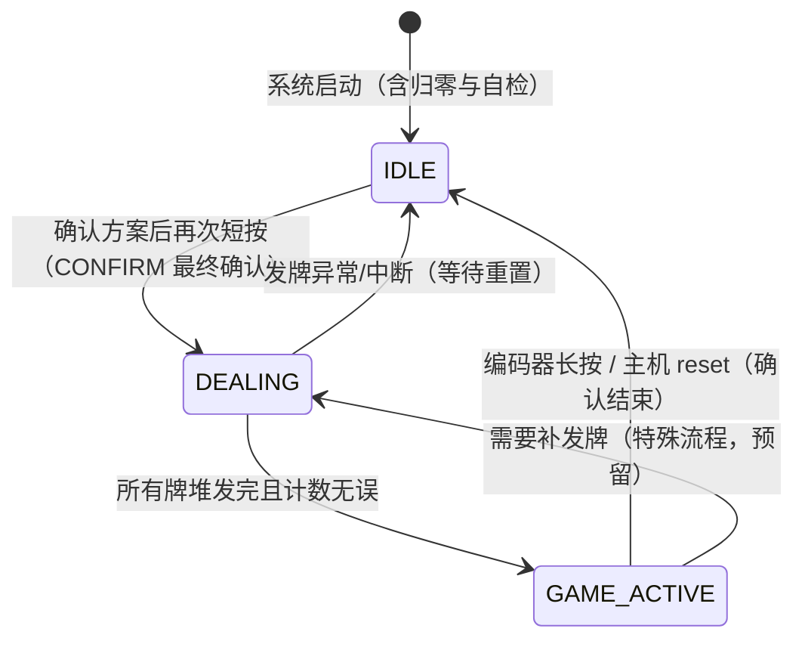
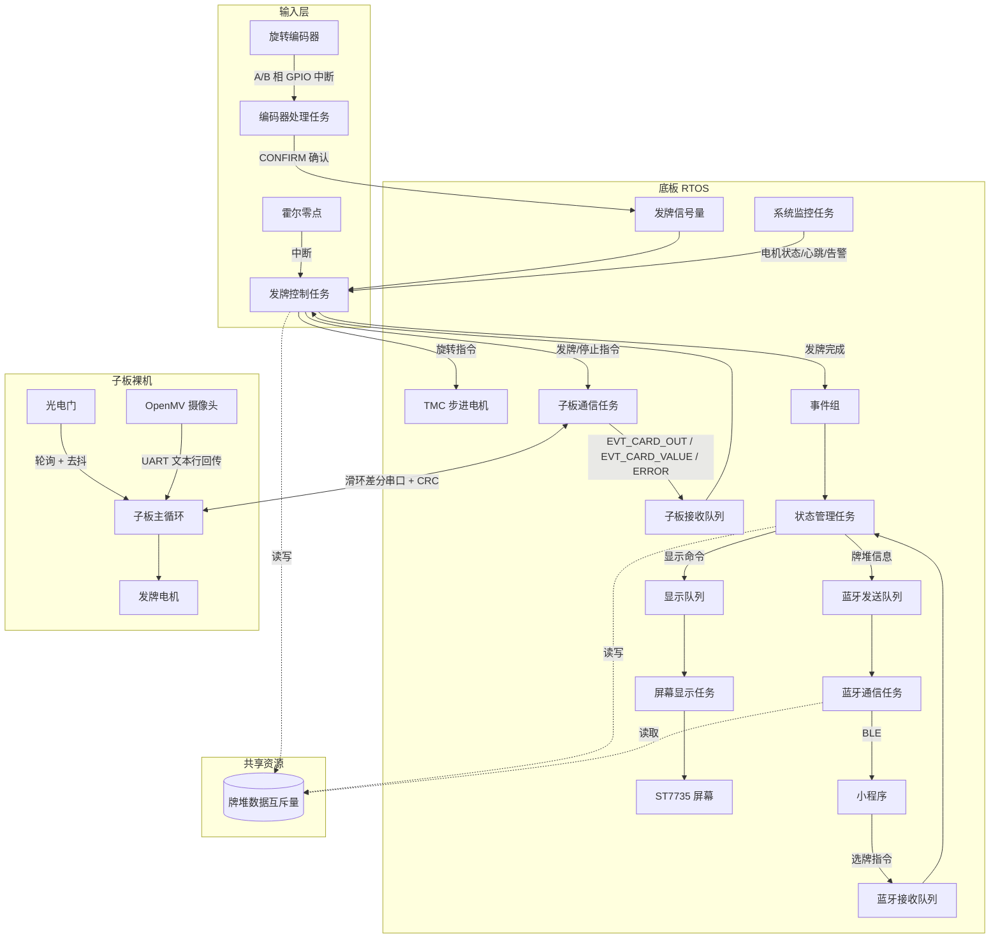

# 发牌机整体架构 v2（底板 RTOS + 子板裸机）

> 版本：v2.1  
> 日期：2026-08-30  
> 来源：整合《发牌机大致架构 v1》、《与 AI 的部分对话》、《ESP32-S3-WROOM-1-N16R8 底板软件开发交接指南》  
> 状态：草稿，**待硬件核对**。交接指南明确提示其内容由 AI 根据原理图整理、可能有错，本文涉及引脚/电气参数处均需以原理图和器件数据手册为准。

## 版本变更摘要

v2 在 v1 的框架上做整合性修订，**不推翻 v1 的主体结构**（状态机、任务集合、ITC 机制、异常处理框架均保留）。主要动作：

1. 明确子板为**裸机（超级循环 + 中断）**架构，不再按 RTOS 任务描述子板逻辑（此前与 AI 对话已达成此结论，v1 中“子板视为外设”的前提与此一致）。
2. 新增底板与子板之间的**通信协议章节**（主从式滑环差分串口、CRC、每张牌实时上报）。
3. 落地《底板交接指南》的硬件约束：IO 映射、电源架构、TMC2209 开发规范、霍尔两段式归零、屏幕 + SD 总线复用、整机故障保护。
4. 保留 v1 的状态机与全部 ITC 对象，仅调整个别队列/信号量的生产来源。

v2.1（2026-08-30）修订：

1. 删除 SELECTING 状态，选方案/确认并入 IDLE：旋转切换/取消 → 短按确认方案 → 再按 CONFIRM 发牌。
2. 屏幕按测试板实现为 ST7735 128×160（1.8"），新增底板 CLI 调试（`sub` / `sim` / `setstate` / 屏幕测试）。
3. 子板实现串口协议（CRC8 / ACK / CLI 注入）与 RGB LED 串口调试指示。

v2.2（2026-09-08）修订：以最新版两板 `include/pins_config.h` 为准更新 IO 映射与接线（滑环 POS/NEG 新定义）；底座步进回归参考程序 STEP/DIR/ENN（不再使用 TMC 单线 UART 电流控制，DIAG/INDEX/STDBY 相关设计移除）；子板调试 RGB LED 已随新硬件配置移除。

v2.3（2026-09-08）修订：删除冗余的 GAME_END 状态（原状态无生产者，不可达）；GAME_ACTIVE 改为编码器长按确认结束并直接回 IDLE，主机 `CMD_RESET`/`CMD_STOP` 同样生效；GAME_ACTIVE 屏改为顶部状态信息 + 底部操作提示，中部与短按编码器预留给后续功能。

v2.4（2026-09-09）修订：屏幕由竖屏 128×160 改为横屏（逻辑 160×128），各界面布局重新排布；同步修正过时的注释（ILI9341/320×240 等）。

v2.5（2026-09-10）修订：实体牌堆位由 4 个扩展到 8 个；发牌方案改为**参数驱动**——预置游戏（斗地主/掼蛋/升级/德州6人/桥牌/测试）+ 串口自定义参数统一生成“发牌计划”，发牌任务只执行计划，不再为每种玩法写发牌逻辑。

v2.6（2026-09-10）修订：摄像头改为“截图后识别”，截图时序由底板统一控制：上一张发牌成功 → 底板发 `CMD_CAM_CAPTURE` → 子板把 `PIN_CAM_TRIG` **拉低**（下降沿）触发截图 → 转盘转到目标牌堆 → 等待识别完成（`EVT_CARD_VALUE`）→ 下发发牌。

v2.7（2026-09-10）修订：子板新增摄像头**回传接收**（不主动取图：UART 中断收帧 → 主循环解析 → 发 `EVT_CARD_VALUE`，超时保留“发空牌”调试路径）；实装子板**心跳**（`CMD_STATUS_QUERY` / `EVT_STATUS` + 3s 掉线判定）；统一两端 CLI 别名规则（去前缀 → 全小写 → 去下划线）；删除未使用的 `DISPLAY_CMD_CARD_PREVIEW`。

v2.8（2026-09-11）修订：发牌方案扩展为**参数 + 发牌方式**两部分——参数新增“总牌数/弃牌堆”概念，方案表改为只存参数、开局现场生成计划；发牌方式分**顺序发牌**与**随机发牌**（硬件随机数洗牌，转盘无序来回转），为互斥选项、独立于方案选择，IDLE 下长按编码器切换、屏幕顶部常驻 `Seq`/`Rand` 徽标。

v2.9（2026-09-12）修订（结构性修复）：① 模拟事件改为**默认关闭且只对 TEST 方案生效**；② 单张牌增加 `EVT_DEAL_DONE` 握手，子板收尾完成才发下一张；③ 子板事件**统一进 `xSubboardRxQueue`**（删除 `xCameraQueue` 等拆分的队列），摄像头错误不再漏判；④ 主机 `stop`/`reset` 通过"中止请求"**能立即中止**正在执行的发牌与底盘转动；⑤ 主机启动发牌要求方案已确认；⑥ 清理无效 ITC（`xEncoderQueue`/`xBluetoothTxQueue`/`xCardDetectedSem`/`xDeckReadySem`、两个无人使用的事件位）与未调用的占位钩子，牌面存储按 `[card, src]` 2 字节压缩。

v3.0（2026-09-12）修订（健壮性 + 时序对齐）：
① **掉线保护落地**：发牌前检查 `sub_comm_online()`，子板不在线直接拒绝启动（模拟/测试路径除外）；
② **摄像头会话清理**：每次触发截图前清空 `Serial2` 残留，避免迟到的旧识别结果被当成这一张；
③ `CMD_CAM_CAPTURE` 在子板会话忙时**回 `EVT_ERROR_CAM_FAIL`**，不再"回 ACK 但没执行"；
④ **事件组不再丢位**：状态任务在一轮里把同批置位的事件全部处理完（原来命中第一个就 continue，会丢掉同批其它请求）；
⑤ **启停原子性**：发牌任务开工前等状态机真正进入 `DEALING`（最多 500ms），避免"状态还没切、发牌已开始"；
⑥ **时序对齐**：底板等 `EVT_CARD_OUT`/`EVT_DEAL_DONE` 的超时由 5s 放宽到 8s（覆盖子板"卡牌+撤回+重试"最坏约 5.7s）；底盘每次到位后增加 `CHASSIS_MOVE_SETTLE_MS`(100ms) 稳定等待，避免转盘还在振动就发牌；删除未使用的 `ROTATE_WAIT_MS` / `SUB_RESP_TIMEOUT_MS` / 子板 `CAMERA_TIMEOUT_MS`。

v3.1（2026-09-12）修订（结构整理）：
① **显示层真正"只展示不决策"**：菜单选中项 / 是否已确认 / 发牌方式从 `display.cpp` 搬到新模块 `deal_selection`（`xSelectionMutex` 保护、提供一致性快照），显示层只按显示命令绘制；同时把散落在编码器/CLI/BLE/状态机里重复拼装菜单显示命令的代码统一成 `display_send_menu()` / `display_send_idle()`。
② 清理死代码：未使用的 `deal_wait_evt()` 包装、`menuList` 字段。
③ `hall_homing()` 明确为"霍尔未接入，以开机位置作为转盘零点"，并保留后续接入时的实现说明。

v3.2（2026-09-12）修订（拆分 `tasks.cpp`）：原来一个 1100 行文件同时装着任务、主机动作、CLI、发牌流程，现拆成——

| 文件 | 内容 | 对外接口 |
|------|------|----------|
| `tasks.cpp` | 任务创建 + 子板通信 / 编码器 / 显示 / 监控 | — |
| `tasks_deal.cpp/.h` | 发牌控制任务（执行计划、错误收口） | `deal_get_status()`、`deal_error_active()`、`deal_sim_set/get_auto()` |
| `host_actions.cpp/.h` | 主机命令动作 + 蓝牙接收任务 | `host_action_select/confirm/deal_start/stop/reset/status` |
| `cli.cpp/.h` | 调试串口命令行 | `cli_poll()` |

拆分只做搬迁与接口收敛，行为不变：跨文件访问的内部变量改成快照接口（`deal_get_status`），CLI 的串口读行逻辑收进 `cli_poll()`。

v3.3（2026-09-12）修订（**开机自检落地**）：`self_test()` 从空实现扩成可用的开机自检，只做**不需要人配合**的项目（方案见 `重要信息/自检流程方案.md`）：
① **自动判定项** —— 编码器引脚空闲电平、霍尔电平读回、BLE 广播状态、**与子板串口握手**（发 `CMD_STATUS_QUERY` 等应答，等待期每 `SELFTEST_SUB_PING_MS`(500ms) 重发，最多 `SELFTEST_SUB_WAIT_MS`(5s)）；
② **可观察项** —— 屏幕色块 + **底盘微动 ±`SELFTEST_CHASSIS_DEG`(3°) 各一次**（净位移 0，不动开机零点）；
③ 结果记入本地位图 `BOT_ST_*`，打印到串口 + 显示到屏幕 `SELFTEST_SHOW_MS`(2s)，CLI 新增 `selftest` 复检（只读不动作，不阻塞通信任务）；
④ 为把自检结果画到屏幕上，`display_init()` 从显示任务提前到 `setup()`（屏幕初始化变成启动第 3 步）；
⑤ 子板 `EVT_READY` 改为携带 2 字节自检位图（`SUB_ST_*`），底板收到只打印、不进业务队列（没有业务消费它，留在队列里会挤掉真实事件）。
交互项（转/按编码器、手转电机试锁轴力矩、拿磁铁试霍尔）不在开机自检里做。

v3.4（2026-09-12）修订（**中断化：把"该用中断的地方"从轮询改成中断**）：
① **编码器 A/B 相改 GPIO 中断**：`init_interrupts()` 在 IO25/IO33 上挂 `CHANGE`，中断里用四态转移表累加（满 4 次有效跳变 = 一格），任务只通过 `encoder_take_steps()` 消费净格数。
   原因：原来 1ms 轮询在快速旋转时两次跳变可能落在同一采样周期里 → 丢步；中断能捕获每个边沿。
   中断里另加两道抗扰：同方向跳变间隔 < `ENCODER_ISR_GUARD_US`(200µs) 丢弃、两相同时变（非法跳变）把累计清零。
   编码器任务节拍由 1ms 放宽到 `ENCODER_POLL_MS`(5ms)——A/B 已不依赖采样率，只剩 SW 按键需要轮询。
② **子板串口 Serial1 改中断接收**：`Serial1.onReceive()` 在中断里只写环形缓冲（`SUB_RX_RING_SIZE` 256B），子板通信任务按 `SUB_COMM_POLL_MS`(5ms) 取出喂协议解析器。
   原因：原来通信任务每 20ms 才轮询一次串口，子板上报事件最多晚 20ms 解析，发牌流程里每张牌有好几次"发命令→等事件"，会累加成时序抖动。
③ 保持轮询的部分（明确不改）：光电门电平采样、摄像头 Serial2 回传、两板 CLI、监控任务周期巡检、步进 STEP 脉冲生成。
   前两者的理由见 [subboard_architecture.md](subboard_architecture.md) 第四章：需要"电平稳定多久"这类时间信息，且边沿中断在电机干扰/浮空引脚下容易被反复触发。
④ 霍尔仍不接入（`hall_homing()` 以开机位置为零点），实现时直接挂 `CHANGE` 中断，不再走轮询。

v3.5（2026-09-12）修订（**收口：竞态与一致性**，按《当前阶段整改核验与结构图》逐条处理）：
① **STOP/RESET 竞态**：中止标志增加"代次"（`motion_abort_generation()` / `motion_abort_clear_if_generation()`）。
   发牌任务在进 DEALING **之前**采样代次，只有代次没变才允许清标志；清完再确认一次状态。
   原来 `motion_abort_clear()` 无条件清，会把启动窗口内刚到的 STOP/RESET 清掉 → 这一局继续转。
② **子板摄像头会话随 STOP/RESET 取消**：新增 `sub_camera_cancel()`（TRIG 回空闲高、清 Serial2 残留、会话复位），
   避免复位后迟到的 `RESULT` 被当成下一局的牌面。
③ **编码器中断/任务同步改成单字无锁**：`s_enc_total` 由中断单调累加，任务侧只用 `s_enc_baseline` 求差值。
   单写者/单读者 + 32 位对齐读写本身原子，不存在"读-改-写"丢更新；
   原来读侧用 `portENTER_CRITICAL`、ISR 却没进同一把锁，跨核时仍可能丢一格。
④ **发牌状态一致快照**：新增 `xDealStatusMutex`；发牌任务每次更新业务变量后整体发布一份 `deal_status_t`，
   `deal_get_status()` 只读快照，不再逐项读多个非原子变量（避免"新进度 + 旧错误"的瞬时组合）。
⑤ 文档收口：修正 `subboard_architecture.md` 里与代码不符的旧描述（重试边界、`EVT_READY` 载荷、
   `CMD_DEAL_START` 载荷、单卡缓冲、CRC 重传、掉线处理），并修正 CLI `simauto` 帮助文字（默认已是 off）。

v3.6（2026-09-13）修订（**无子板模式 / 子板仿真**）：底板与子板经常分开调试，把原来那个"模拟事件"扩成完整的无子板模式：
① **开关**：编译期 `USE_SUBBOARD`（`app_config.h`，`0` = 上电即进入无子板模式）+ 运行时 CLI **`subsim on|off`**（`simauto` 保留为旧别名，语义相同）。
② **行为**：跳过"子板不在线就拒绝开局"的检查；**不再下发动作类命令**（截图 `CMD_CAM_CAPTURE`、发牌 `CMD_DEAL_START`、停机 `CMD_STOP`、复位 `CMD_RESET`、转发自检 `CMD_SELF_TEST`），免得误驱动还连着的真子板；每张牌的牌面（`EVT_CARD_VALUE`）、出牌成功（`EVT_CARD_OUT`）、单张完成（`EVT_DEAL_DONE`）由底板自己按 `SIM_CAMERA_DELAY_MS` / `SIM_PHOTO_DELAY_MS` 补发。
③ **关键变化**：模拟事件**不再限定 TEST 方案**——打开无子板模式后任何方案都能单独跑通。v2.9 的"只对 TEST 生效"是"默认关闭"状态下的防呆，现在由这个显式开关取代。
④ **可观测性**：启动横幅打印 `[BOOT] sub board mode: SIM / REAL`；自检的"子板链路 FAIL"提示里补了"单独测底板可敲 `subsim on`"。
⑤ 心跳 `CMD_STATUS_QUERY` 仍然照发（只用于在线状态显示，不产生任何动作）。

v3.7（2026-09-13）修订（**子板光电门改为"动作期间只记录、动作结束后统一判定"**）：
① 单张牌动作改成**固定时长**，不再由光电门决定何时换相：
   `MOTOR_ON`(正转 `MOTOR_FWD_MS`) → `BRAKE` → `REVERSE` → `PAUSE` → 判定 → `SEND_BACK`；两种模式共用同一条流程。
② 光电门退化成**记录器**：动作期间只记录"是否出现过有牌"，动作结束、电机停稳后再结合当前电平判定
   **成功发出 / 卡在出牌口 / 根本没出去**；两种失败走既有自救路径（反转撤回 → 重试 → 报 `EVT_ERROR_CARD_JAM`）。
③ 连带变化：删除子板状态 `WAIT_CARD`/`WAIT_GONE` 与 `PHOTO_TIMEOUT_MS`/`PHOTO_JAM_MS`/`MOTOR_STARTUP_MS`；
   `EVT_CARD_OUT` 由"牌离开光门的瞬间"改为"整张动作确认成功后"发出（底板侧语义与顺序不变）；
   底板等出牌/收尾的超时仍为 `PHOTO_TIMEOUT_MS`(8s)，新最坏情况约 4.2s，余量充足。

v3.8（2026-09-13）修订（**发牌方案：特殊牌分流 + 分拣模式 + 方案表重排**）：
① **方案表重排**：真实牌局 → 分拣 → Custom → **测试方案（Test / RotateTest）永远排最后**，并用 `static_assert` 守住这个约定（以后增删方案照此排列）。
② **特殊牌分流（参数扩展）**：`deal_params_t` 新增 `special`（类别：`joker`/`joker_small`/`joker_big`/`jqk`/`back`）与 `specialCount`（这类牌在牌源里的**已知张数**）。
   分配表按**普通牌数**（`totalCards − specialCount`）生成，被挑出来的牌**不占名额**、直接送弃牌堆，因此各牌堆收到的张数仍精确等于分配表。
   典型用法：牌源装 54 张（含王）发德州 6 人 → `special=joker:2`，王进弃牌堆，6 人各 2 张 + 公共 5 张不受影响。
③ **分拣模式 `DEAL_MODE_ROUTE`**：前置工作、不是牌局 —— 不看牌局参数，把牌源**全部发完**，按牌面分流到主堆/专用堆。
   两个预置：`SortJoker`（王 → 王堆）、`SortFace`（牌背 → 背面堆）；张数不需要预先知道（`specialCount = 0`），靠“发完牌源”结束。
④ **逐张落点决策**：发牌任务由“逐组发”改成“游标 + 逐张”——有分流规则的计划**先拿牌面再转动**（落点由牌面决定）；
   没有分流规则的计划保持原来的“截图与转动并行”，时序不变。
⑤ 收尾核对：结束时打印实际分流张数，与参数声明不符时提示（牌源装错牌最容易在这露出来）；无子板模式下会按“牌源 ÷ 特殊牌张数”的间隔模拟出对应类别，方便验证分流逻辑。

v3.9（2026-09-16）修订（**底盘转动时序两处优化**）：
① **同牌堆不重复转动**：`rotate_to_deck()` 先查新增的 `chassis_at_angle()`，已经停在目标角度就直接跳过——
   随机发牌"同一组内连发多张"、顺序发牌同堆相邻张都属于这种情况。跳过时不再调用运动函数、不再打 `[STEP] top …` 日志，
   日志里会出现 `[DEAL] deck N: already there, skip rotate` 便于确认。
   （说明：原来 `chassis_run_relative(0)` 本来就会立即返回、**并不产生等待**，所以这条省下的是函数调用与日志噪声，
   以及对"到底转没转"的判读成本；真正的等待时间优化见第 ② 条。）
② **等待时长自适应转速**：
   - 到位稳定等待由固定 `CHASSIS_MOVE_SETTLE_MS`(100ms) 改为 **「电机轴转一圈时间 × `CHASSIS_SETTLE_K`(0.05)」**，
     再夹到 `CHASSIS_SETTLE_MIN_MS`(40) ~ `CHASSIS_SETTLE_MAX_MS`(200) 之间。30rpm（2s/圈）下正好是原来的 100ms，
     转速提高后自动缩短，**改 `CHASSIS_RPM` 不用再重调常数**；
   - 转动超时由"预计用时 + 5s、且下限 60s（实际等于永不触发）"改为 **「预计用时 × `CHASSIS_TIMEOUT_FACTOR`(3) + `CHASSIS_TIMEOUT_MARGIN_MS`(2s)」**，下限 `CHASSIS_TIMEOUT_MIN_MS`(3s)，
     堵转/失步能真正在几秒内被发现并断电报警；
   - `chassis_run_relative()` 现在会把「预计用时 / 超时 / 实际用时 / 本次稳定等待」都打进串口日志，便于按实测调系数。

v4.0（2026-09-16）修订（**低功耗 A 级 + 引脚更正**）：
① 子板 `PIN_CAM_TRIG` 由 **GPIO20 改到 GPIO4**：20 与子板电机方向脚 `PIN_MOTOR_AIN2` 撞脚（两者会互相打架），
   且 GPIO19/20 是 ESP32-S3 原生 USB 的 D-/D+。旧 PCB 已损坏、现按飞线自由分配（详见 `SubBoard/include/pins_config.h`）。
② **底盘步进驱动在不锁轴的时段断电**：进入 IDLE（且 `CHASSIS_IDLE_POWER_DOWN_MS` 内无转动）或 GAME_ACTIVE 时
   `chassis_power_release()` 把 EN 拉高、断开绕组保持电流；**DEALING 期间保持使能锁轴**——
   推牌的反作用力会把转盘顶偏，一旦实际角度与软件记录的位置分叉，后面每张牌都会落错堆。
   实现上由 `vDealTask` 在**每局开始时统一使能一次**（`chassis_enable_driver()`），不依赖"转到才使能"：
    否则本局第一张牌恰好不用转动（`chassis_at_angle()` 命中）时整局都不会使能，转盘全程自由。
   新增 CLI `power`（查看 CPU/驱动/蓝牙状态）与 `power motor on|off`（手动强制，便于验证）。
③ **CPU 按状态降频**：IDLE 且蓝牙未连接时 80MHz；DEALING / GAME_ACTIVE / 蓝牙已连接时 240MHz。
   经典 ESP32 在 80MHz 与 240MHz 下 **APB 都是 80MHz**（Arduino 核心 `calculateApb()`：freq ≥ 80 → 80MHz），
   所以 UART 115200、屏幕 SPI 10MHz、`millis()`/`micros()` 全部不受影响——降频只改"代码跑多快"，不引入时序错误。
④ **蓝牙省电**：`esp_bt_sleep_enable()`（控制器休眠）+ 广播间隔放宽到 `BLE_ADV_INTERVAL_UNITS`(160 = 100ms，库默认 20ms)，
   代价是手机扫描发现该设备会晚一点点。
⑤ **子板省电**：主循环按 `SUB_LOOP_DELAY_MS`(1ms) 让出 CPU（原来 `loop()` 全速空转、CPU 常驻满载）；
   CPU 降到 `SUB_CPU_MHZ`(80MHz)，S3 的 APB 恒为 80MHz，故 UART/LEDC PWM 时基不变；
   发牌电机 TB6612 的 STBY 在空闲时拉低进待机（µA 级）。子板侧详见 [subboard_architecture.md](subboard_architecture.md) 第十一章。

与 v1 的逐项差异见 [architecture_v2_diff.md](architecture_v2_diff.md)；子板详细设计见 [subboard_architecture.md](subboard_architecture.md)。

---

## 一、系统概述与硬件架构

### 1.1 系统组成

- **底板**：经典 ESP32（ESP32 Dev Module / `esp32dev`，4MB Flash），负责整体逻辑控制：底座转盘步进电机、屏幕 + SD 卡、旋转编码器、霍尔零点传感器、蓝牙（ESP32 内置 BLE）与小程序通信、滑环串口与子板通信。
- **子板（上层模组）**：ESP32-S3，负责发牌电机、光电门、摄像头（视觉识别）；被视为“带反馈的执行器”，预处理后通过滑环串口将信息实时传回底板统一处理。
- **滑环**：连接底板与上层模组，提供 12V / 6V / 5V 供电通道 + 差分串口 RING_UART±，各路电源串联自恢复保险丝并带 ESD 防护。

### 1.2 硬件部件总览（基于 v1 表格更新）

| 部件 | 所属板 | 连接方式 | 功能 |
|------|--------|----------|------|
| 底座转盘电机（步进） | 底板 | TMC2209 驱动（STEP/DIR/ENN；1/8 细分由 MS1/MS2 设定；电流由驱动板 VREF 电位器设定） | 控制转盘旋转到指定牌堆（8 个实体牌堆位） |
| 发牌电机 | 子板 | GPIO/PWM（6V 直流电机） | 从牌堆发出一张牌 |
| 摄像头 | 子板 | UART（OpenMV H7 Plus：TX/RX + TRIG **下降沿触发**，子板只接收回传） | 发牌时记录牌面信息（花色、点数） |
| 光电门（原光敏传感器） | 子板 | GPIO **轮询 + 去抖**（有牌 = 低电平 GND） | 检测牌是否成功发出、计数 |
| 屏幕 | 底板 | SPI（ST7735 128×160 面板，软件横屏 160×128；最终型号以原理图为准） | 显示方案、状态、牌面 |
| SD 卡 | 底板 | SPI（与屏幕共用总线，独立片选） | 存储牌照图片、整机配置文件 |
| 旋转编码器 | 底板 | GPIO（A/B 相 + 按键） | 选择/取消方案、确认方案、CONFIRM 发牌、重置 |
| 霍尔零点传感器 | 底板 | GPIO（A3144，集电极开路） | 转盘上电绝对归零、运行中失步校准 |
| 蓝牙 | 底板 | ESP32 内置 BLE | 与小程序通信（选牌、查询、状态上报） |
| CH340 调试串口 | 底板 | UART0（TXD0/RXD0） | 固件下载、运行日志、上位机指令交互 |

> 注：交接指南提到底板另有 SW3“2.4G 自定义功能按键”，可预留为自定义功能入口，具体用途待定。

### 1.3 底板 IO 映射表（经典 ESP32）

> **引脚以底板 `include/pins_config.h` 为唯一真源**，下表只是便于阅读的摘要；旧《交接指南》的 ESP32-S3 引脚表已废弃。
> 经典 ESP32 的硬约束：**GPIO6~11 接内部 Flash 不可用**；**GPIO34~39 仅输入且无内部上拉**（不要用于编码器/霍尔）；
> GPIO0/2/12/15 是 strapping 脚，接线时注意上电电平。

| IO 引脚 | 硬件网络名 | 外设功能定义 | 方向 | 补充说明 |
|---------|------------|--------------|------|----------|
| IO0 | BOOT | 程序下载启动按键 | 输入 | 下拉至 GND，下载专用 |
| IO4 | SD_CS | SD 卡片选（预留） | 输出 | 当前未接线、未初始化 |
| IO5 | SD_MISO | SPI 数据输入（SD 卡，预留） | 输入 | 当前未接线 |
| IO6~11 | — | 内部 SPI Flash | — | **不可用** |
| IO12 | RING_UART_NEG | 滑环串口负极（本板 RX） | 输入 | 连子板 NEG(TX)；⚠️ strapping 脚 |
| IO13 | HALL | A3144 霍尔零点传感器 | 输入 | 必须 `INPUT_PULLUP` |
| IO14 | TMC_RX | TMC2209 单线 UART 接收（预留） | 输入 | 当前固件未启用 UART |
| IO15 | RING_UART_POS | 滑环串口正极（本板 TX） | 输出 | 连子板 POS(RX)；⚠️ strapping 脚 |
| IO16 | DRIVER_STEP | TMC2209 步进脉冲 | 输出 | 脉冲频率控制转速 |
| IO17 | DRIVER_DIR | 步进方向 | 输出 | 高低电平切换正反转 |
| IO18 | TFT_CS | TFT 片选 | 输出 | 刷新时拉低 |
| IO19 | TFT_RESET | TFT 硬件复位 | 输出 | 低电平复位，高电平正常 |
| IO21 | TFT_DC | TFT 数据/命令选择 | 输出 | 低=寄存器指令，高=图像数据 |
| IO22 | SPI_MOSI | SPI 数据输出（屏幕 + SD） | 输出 | 屏幕、SD 共用 |
| IO23 | SPI_SCK | SPI 公共时钟（屏幕 + SD） | 输出 | 屏幕、SD 共用 |
| IO25 | EC11_A | 编码器 A 相 | 输入 | `INPUT_PULLUP`，正交解码（**GPIO 中断**，见 3.1） |
| IO26 | DRIVER_ENN | 驱动使能 | 输出 | 高=断电，低=工作；到位后保持低电平锁轴 |
| IO27 | TMC_TX | TMC2209 单线 UART 发送（预留） | 输出 | 当前固件未启用 UART |
| IO32 | EC11_SW | 编码器按键 | 输入 | 按下为低电平，任务轮询 + 10ms 消抖（**不挂中断**：按键是慢事件） |
| IO33 | EC11_B | 编码器 B 相 | 输入 | `INPUT_PULLUP`，正交解码区分方向（**GPIO 中断**） |
| IO34~39 | — | 仅输入、无内部上拉 | — | 不要用于编码器/霍尔 |
| GPIO1/3 | TXD0/RXD0 | 调试串口 | — | 日志、上位机指令；不要占用 |

### 1.4 电源架构

| 电源轨 | 转换电路 | 供电对象 |
|--------|----------|----------|
| 6V | MP1584EN（7.4V→6V） | 上层发牌/洗牌直流电机（经滑环输出） |
| 5V | MP1584EN（7.4V→5V） | A3144 霍尔、EC11、CH340、滑环 5V、Type-C 调试口 |
| 12V | XL6009（7.4V→12V） | 仅 TMC2209 步进驱动（滑环对外输出 12V） |
| 3.3V | AMS1117-3.3（5V→3.3V） | 主控内核、SPI 屏幕、SD 卡、3.3V 信号 IO、霍尔上拉 |

> Micro USB 调试供电口仅允许离线调试霍尔、编码器、光电传感器，**禁止**为视觉模组和满载电机供电（二极管压降后仅 4.6~4.7V）。

---

## 二、软件架构总览

### 2.1 总体分层

| 板块 | 架构选择 | 理由 |
|------|----------|------|
| 底板 | **FreeRTOS（Arduino 框架，PlatformIO）** | 任务多且并发复杂：蓝牙、编码器、屏幕、状态机、子板通信，需 RTOS 解耦 |
| 子板 | **裸机超级循环 + 中断** | 串行流水线逻辑，无多优先级并发需求；响应快、资源省、调试直观（详见子板架构文档） |
| 板间通信 | 主从式差分串口（滑环） | 底板为主、子板为从；CRC 校验、短包分帧、掉线超时保护 |

### 2.2 职责边界（v2 明确分工）

| 层面 | 归属 | 说明 |
|------|------|------|
| 物理层异常（卡牌 / 牌没出去） | **子板**检测 → 先本地自救 → 自救失败才上报 | 动作结束后按光电门记录判定（成功/卡住/没出去），失败先反转撤回（`RETRACT`，成功自动重试 ≤ `PHOTO_JAM_RETRY_MAX` 次）；自救失败才发 `EVT_ERROR_CARD_JAM`，不做业务层决策 |
| 机械层异常（发牌电机堵转电流） | **子板**检测并立即上报 | 驱动电路检测电流异常，底板决定是否停止/急停 |
| 机械层异常（底座电机堵转/超时、霍尔失效） | **底板**检测 | 软件超时保护、归零超时保护（DIAG/温度轮询当前未启用） |
| 业务层决策（漏发/多发、重发、停止） | **底板** | 底板收到实时事件后自行累加计数，按状态机决定重发或报警 |
| 整副牌堆数据上传小程序 | **底板** | 底板逐张接收并拼装，整局结束后统一经蓝牙上传 |

> 关键通信原则：**子板 → 底板逐张实时上报，底板 → 小程序统一上传**。

---

## 三、底板任务划分（RTOS）

### 3.1 任务列表

| 任务名 | 优先级 | 核心绑定建议 | 职责 | 周期/触发方式 |
|--------|--------|--------------|------|----------------|
| 蓝牙通信任务 | 高 (3) | 任意 | 接收小程序指令（选牌、查询状态），发送牌堆信息、发牌状态 | 队列阻塞 |
| 子板通信任务 | 中 (2) | 固定核心0 | 底板与子板数据收发：指令下发、事件解析（光敏计数、牌面识别、异常上报） | 串口中断 + 环形缓冲 + 队列 |
| 发牌控制任务 | 中高 (2) | 固定核心1 | 执行发牌主流程：锁存发牌计划 → 逐组/逐张：发截图命令 → 转到位 → 等牌面 → 发牌 → 等出牌成功 → **等 `EVT_DEAL_DONE`（子板收尾完成）** → 更新进度；STOP/RESET 可随时中止 | 信号量/队列 |
| 编码器处理任务 | 中 (2) | 任意 | 旋转切换/取消、短按确认/发牌/重置 | **A/B 中断解码 + SW 轮询消抖** |
| 屏幕显示任务 | 低 (1) | 任意 | 事件驱动刷新屏幕（菜单、进度、牌面、结果、错误） | 队列阻塞（非轮询） |
| 状态管理任务 | 低 (1) | 任意 | 维护全局状态机，协调任务间状态切换 | 事件组 |
| 系统监控任务 | 低 (1) | 任意 | 周期巡检电机到位/超时状态、滑环通讯心跳、告警上报 | 定时器周期触发 |

> 与 v1 的对应关系：v1 中“光敏检测任务/子板、发牌控制任务/子板、摄像头采集任务/子板”三条不再属于底板 RTOS，其职责由子板裸机状态机承担，底板侧只保留“子板通信任务 + 发牌控制任务”作为编排入口。详见差异文档。

### 3.2 优先级设计依据（保留 v1）

| 优先级 | 任务 | 理由 |
|--------|------|------|
| 高 (3) | 蓝牙通信 | 及时响应用户操作（选牌、远程控制） |
| 中高 (2) | 发牌控制 | 核心功能，涉及电机时序，需保证连续性 |
| 中 (2) | 编码器、子板通信 | 用户交互与数据采集，及时但不苛刻 |
| 低 (1) | 屏幕显示、状态管理、系统监控 | UI 与巡检不紧急，避免占用 CPU 影响实时控制 |

### 3.3 任务触发方式统一表（来自与 AI 的对话）

| 任务名 | 触发方式 | 等待对象 | 触发时机 | 触发来源 |
|--------|----------|----------|----------|----------|
| 编码器处理任务 | A/B 中断 + SW 轮询 | —（无队列） | A/B 相 GPIO 中断四态解码（4 跳变 = 1 格）；SW 每 `ENCODER_POLL_MS`(5ms) 轮询 + `ENCODER_DEBOUNCE_MS`(10ms) 消抖 | 用户物理操作 |
| 发牌控制任务 | 同步触发 | `xDealSemaphore` | CONFIRM 最终确认后由编码器任务 Give | 用户确认操作 |
| 子板通信任务 | 串口中断 + 队列 | 接收队列 + 发送队列 | 子板上报事件，或底板下发指令 | 子板硬件事件 / 发牌任务请求 |
| 蓝牙通信任务 | 队列阻塞 | 接收/发送队列 | 小程序指令到达，或状态管理任务有数据待发 | 小程序操作 / 系统状态上报 |
| 状态管理任务 | 事件组 | `xStateEventGroup` | 发牌完成、结束/重置回 IDLE 等 | 其他任务执行完毕 |
| 屏幕显示任务 | 队列触发 | `xDisplayQueue` | 任何需要屏幕更新的事件发生 | 所有其他任务均可触发 |
| 系统监控任务 | 定时器周期 | 软件定时器 | 周期巡检电机状态 / 通讯心跳 / 告警 | 定时器 |

设计原则：

1. 每个任务只有一种主要触发方式（等队列或等信号量，不混用）。
2. 永久阻塞为常态；**超时阻塞只用于异常检测或任务节拍**（如子板通信任务以 `SUB_COMM_POLL_MS` 5ms 兜底节拍、发牌任务等事件时 50ms 轮转检查中止请求）。
3. 状态管理任务只做协调，不直接执行业务。
4. 屏幕显示任务“只展示、不决策”，完全被动响应。

---

## 四、任务间通信与同步机制（ITC）选型

### 4.1 队列（数据传递）

| 队列名 | 数据内容 | 生产者 | 消费者 | 容量 |
|--------|----------|--------|--------|------|
| `xBluetoothRxQueue` | 小程序指令字节（选牌、查询） | BLE 回调 | 蓝牙任务（解析） | 10 |
| `xSubboardRxQueue` | **全部**子板业务事件（牌面 / 出牌 / 单张完成 / 错误） | 子板通信任务（`proto_on_event`） | 发牌控制任务 | 20 |
| `xSubboardTxQueue` | 底板下发指令（截图 / 发牌 / 停止…） | 发牌控制、主机动作 | 子板通信任务 | 10 |
| `xDisplayQueue` | 屏幕显示命令（见附录 A） | 状态管理/发牌/编码器/蓝牙任务 | 屏幕显示任务 | 5 |

> 说明：事件不再拆成多个队列——牌面、出牌、单张完成、错误**统一进 `xSubboardRxQueue`**，由发牌任务按 `type` 分发。
> 这样摄像头报错（`EVT_ERROR_CAM_FAIL`）不会因为进错队列而让等待方看不到；`EVT_ACK` / `EVT_STATUS` 只打印、不进队列。
> 编码器与蓝牙发送都不再经过队列（编码器 A/B 走 GPIO 中断、BLE 直接 notify），原来的 `xEncoderQueue` / `xBluetoothTxQueue` / `xCameraQueue` 已删除。
> 子板串口的接收侧也不经过 FreeRTOS 队列：中断写环形缓冲（`hardware.cpp`），通信任务按节拍取出解析。

### 4.2 信号量（事件同步）

| 信号量 | 类型 | 初始值 | 用途 |
|--------|------|--------|------|
| `xDealSemaphore` | 二值 | 0 | 发牌准备就绪，通知发牌控制任务开始 |

> 说明：原来给 `EVT_CARD_OUT` / `EVT_READY` 用的 `xCardDetectedSem`、`xDeckReadySem` 只有 Give 没有 Take，属于无效同步对象，已删除；
> 发牌任务现在直接在 `xSubboardRxQueue` 上等对应事件。

### 4.3 互斥量（保护共享资源）

| 互斥量 | 保护对象 | 原因 |
|--------|----------|------|
| `xDeckDataMutex` | 牌堆数据（牌面信息、已发数量） | 发牌写入、蓝牙读取、屏幕显示可能同时访问 |
| `xStateMutex` | 全局状态变量 | 状态管理任务写入，其他任务查询 |
| `xSelectionMutex` | 发牌选择状态（方案 / 是否确认 / 顺序或随机） | 编码器、CLI、BLE、状态机都会改，显示层读快照 |
| `xDealStatusMutex` | 发牌状态快照 `deal_status_t` | 发牌任务整体发布、CLI（将来还含 BLE）一致读，避免半新半旧 |

### 4.4 事件组（多条件等待）

| 事件组 | 用途 |
|--------|------|
| `xStateEventGroup` | 通知各任务系统状态变化（发牌完成、结束/重置等），支持“多条件同时满足”等待 |

---

## 五、状态机设计

### 5.1 状态定义（2026-08 删除 SELECTING；2026-09 删除 GAME_END）

| 状态 | 含义 | 可执行操作 |
|------|------|------------|
| IDLE | 待命 / 选方案状态 | 旋转切换方案（旋转即取消已确认）；短按确认方案（顶部显示已选）；再次短按 CONFIRM 进入发牌 |
| DEALING | 发牌中 | 底座旋转、子板发牌、光敏检测、摄像头识别 |
| GAME_ACTIVE | 牌局进行中 | 屏幕顶部显示状态、底部长按提示；长按编码器确认结束并直接回 IDLE；短按与屏幕中部预留给后续功能 |

### 5.2 状态转移图



### 5.3 状态转移条件详细说明

| 转移 | 触发条件 | 动作 |
|------|----------|------|
| IDLE → DEALING | 已确认方案后再次按下（CONFIRM 最终确认） | ① 锁存方案参数 ② 启动发牌任务 ③ 更新屏幕为“发牌中” |
| DEALING → GAME_ACTIVE | 所有牌堆发完且光敏计数无误 | ① 上传牌堆信息到小程序 ② 屏幕显示“等待选牌” |
| DEALING → IDLE | 发牌异常（漏发/多发/卡牌） | ① 显示错误信息 ② 等待编码器重置 |
| GAME_ACTIVE → IDLE | 编码器长按确认结束（或主机 `CMD_RESET`/`CMD_STOP`） | ① 复位状态与屏幕（已确认选择清空）② 牌局数据在下一局开始时清空 |
| GAME_ACTIVE → DEALING | 需要补发牌（特殊流程） | 预留，待方案细化后启用 |

---

## 六、任务间数据流示意图



---

## 七、底板与子板通信协议（v2 新增）

### 7.1 物理层与可靠性要求

- 物理通道：滑环串口（POS/NEG 各一线，POS 连 POS、NEG 连 NEG + 共地；**具体引脚见两板 `include/pins_config.h`**，当前按 2 线普通 UART 处理）。
- 电机启停电磁干扰强，**所有数据包必须带 CRC 校验**；校验失败的帧直接丢弃（当前**没有重传协议**：靠"下一张牌的周期"自然恢复 + 底板各项等待超时兜底）。
- 单次数据包长度不宜过长，分小段发送，降低干扰丢包概率。
- 增加通讯掉线超时保护：**开局前**检查子板在线（离线直接拒绝启动并报 `sub offline`）；**运行中**掉线不做立即暂停，由各等待超时兜底（见第八章 8.2 与 [subboard_architecture.md](subboard_architecture.md) 第七章）。

### 7.2 帧格式草案

```
帧头(0xA5) | 类型(1B) | 长度(1B) | 数据(nB) | CRC(1B) | 帧尾(0xAA)
```

- 底板 → 子板为**命令**，子板 → 底板为**事件**。
- 帧格式 / CRC / 命令事件表 / ACK / CLI 注入已定稿为 [board_protocol.md](board_protocol.md)；本节保留概要。

### 7.3 命令/事件分类（草案）

| 方向 | 类型 | 内容 |
|------|------|------|
| 底板 → 子板 | `CMD_DEAL_START` | 启动发牌电机发一张牌 |
| 底板 → 子板 | `CMD_STOP` | 停止电机 / 急停 |
| 底板 → 子板 | `CMD_STATUS_QUERY` | 查询子板状态 |
| 底板 → 子板 | `CMD_SELF_TEST` | 触发子板自检 |
| 底板 → 子板 | `CMD_RESET` | 复位子板状态机（错误恢复） |
| 底板 → 子板 | `CMD_CAM_CAPTURE` | 触发摄像头截图（子板把 `PIN_CAM_TRIG` **拉低**一个脉冲，OpenMV P6 下降沿触发） |
| 子板 → 底板 | `EVT_READY` | 上电自检完成，等待命令 |
| 子板 → 底板 | `EVT_CARD_OUT` | 光敏检测到一张牌发出（成功标志） |
| 子板 → 底板 | `EVT_CARD_VALUE` | 牌面识别结果（`data = [card, src]`：牌面编码 0~55 + 来源） |
| 子板 → 底板 | `EVT_DEAL_DONE` | 单张发牌流程完成 |
| 子板 → 底板 | `EVT_ERROR_CARD_JAM` | 卡在出牌口 / 根本没出去，且撤回重试仍失败（物理层异常，立即上报） |
| 子板 → 底板 | `EVT_ERROR_MOTOR_STALL` | 发牌电机堵转（如支持电流检测） |
| 子板 → 底板 | `EVT_ERROR_CAM_FAIL` | 摄像头识别失败（标记未知牌） |
| 子板 → 底板 | `EVT_ACK` | 命令确认回执（调试用，data=原 type+原 data） |
| 子板 → 底板 | `EVT_STATUS` | 状态回执（心跳应答）：data=[state, error, countLo, countHi] |

> 心跳（v2.7）：底板监控任务每 `COMM_HEARTBEAT_MS`(1s) 发 `CMD_STATUS_QUERY`，子板回 `EVT_STATUS`；
> `COMM_DEAD_TIMEOUT_MS`(3s) 内没收到任何子板帧即判定掉线，串口打印 `[MON] sub board OFFLINE`，可用底板 CLI `subboard` 查询。

### 7.4 实时上报与统一上传原则

1. **子板 → 底板（物理层）**：每发一张牌实时上报一次，数据包含 `{牌序号, 牌面值, 成功/失败标志}`；子板不缓存整副牌数据。
2. **子板异常**：单张动作跑完后按光电门记录判定；卡住/没出去先**本地自救**（反转撤回 `RETRACT`，恢复后自动重试这一张 ≤ `PHOTO_JAM_RETRY_MAX` 次）；自救失败才立即上报 `EVT_ERROR_CARD_JAM`。堵转/摄像头异常则直接上报。
3. **底板（业务层）**：收到实时事件后更新内存中的牌堆数组，并发送屏幕显示命令。
4. **底板 → 小程序（业务层）**：整局发牌结束后，底板把拼装好的完整牌堆列表一次性上传小程序。
5. **单张牌的握手（v2.9）**：底板按 `EVT_CARD_OUT` 判定"牌已出"，再等 `EVT_DEAL_DONE` 确认子板已完成收尾（刹车/反转/停顿、回到可接收状态）后才发下一张的 `CMD_DEAL_START`，避免命令早到被丢弃。
6. **中止（v2.9）**：主机 `stop` / `reset` 会置"中止请求"，底板发牌任务与底盘运动循环都会尽快退出（停止转动、不再发新命令），状态由状态管理任务切回 IDLE；主动中止不产生错误记录。

### 7.5 发牌计划（参数驱动 + 顺序/随机 + 特殊牌分流 + 分拣；v2.5 引入 / v2.8、v3.8 扩展）

实现文件：`BottomBoard/include/deal_config.h` / `src/deal_config.cpp`。

- **数据模型**：发牌计划 = 有序的“发牌组”列表（每组 = `{牌堆编号, 张数, 标签}`）+ 可选的特殊牌分流规则。
  没有分流规则时，每张牌的顺序为：确认上一张成功 → 底板发截图命令（子板把 `PIN_CAM_TRIG` **拉低**）→ 转盘转到该牌堆 → 等待识别完成 → 下发发牌 → 等待出牌成功；
  **有分流规则时**把“等牌面”提到“转盘转动”之前——因为落点由牌面决定（见下面的特殊牌分流）。
- **参数模型**：`{人数, 每人张数, 公共牌, 底牌, 总牌数, 特殊牌类别, 特殊牌张数}`
  - 需要的牌 = 人数×每人 + 公共 + 底牌；**普通牌数 = 总牌数 − 特殊牌张数**；**弃牌 = 普通牌数 − 需要的牌**；
  - 牌堆位占用 = 人数 + [公共>0] + [底牌>0] + [弃牌>0 或 有特殊牌]，上限 8；
  - 总牌数 = **牌源里实际装的牌数**（含特殊牌与多余的弃牌）；分拣模式另有 `DEAL_SORT_SOURCE_CARDS`（默认 54）；
  - 方案表只存**参数**，计划在开局时按“当前发牌方式”现场生成（同一方案可顺序发也可随机发）。
- **两种发牌方式**（互斥，全局一个当前值；IDLE 下长按编码器切换，IDLE 屏顶部 `Seq`/`Rand` 徽标常驻显示）：

  | 方式 | 生成规则 | 实际发牌张数 |
  |------|----------|--------------|
  | 顺序 Sequential | P1 全部 → P2 全部 → … → 公共 → 底牌 | 只发“需要的牌”，弃牌留在牌源 |
  | 随机 Random | 按“每堆该拿几张”做分配表 → 硬件随机数 Fisher–Yates 洗牌 → 连续相同项合并成发牌组 | 整副牌 `totalCards` 全部发出，多余的进“弃牌堆” |

  - 随机模式的转盘会**无序**地来回转（相邻两张常落在不同牌堆）；实测平均组数：斗地主 ≈39、掼蛋 ≈82、德州6人 ≈28，最坏 <110（上限设 160）。
- **特殊牌分流**（v3.8）：声明“哪一类牌算特殊牌 + 源里有几张”，这类牌**不占分配表名额**，执行时按牌面判断、命中就直接送弃牌堆：

  | 类别 | 含义 | 一副牌张数 |
  |------|------|-----------|
  | `joker` / `joker_small` / `joker_big` | 任意王 / 小王 / 大王 | 2 / 1 / 1 |
  | `jqk` | J、Q、K | 12 |
  | `back` | 牌背（正面朝下） | 随牌堆状态，必须显式给张数 |
  | `none` | 不挑牌（默认） | — |

  - 张数是**必须给对**的已知量：分配表按 `总牌数 − 特殊牌张数` 生成，给错就会张数对不上；
  - 结束时底板打印实际分流张数与声明值的差异，便于发现“牌源装错牌”；
  - 例：牌源装 54 张（含王）发德州 6 人 → `special=joker:2`，王进弃牌堆，6 人各 2 张 + 公共 5 张不受影响。
- **分拣模式**（v3.8，`DEAL_MODE_ROUTE`）：**前置工作、不是牌局** —— 不看牌局参数，把牌源全部发完、按牌面分成两堆；
  张数不需要预先知道（`specialCount = 0`），靠“发完牌源”结束：

  | 方案 | 命中规则的牌 | 其余 |
  |------|-------------|------|
  | `SortJoker` | 大小王 → 王堆（deck 2） | → 主堆（deck 1） |
  | `SortFace` | 牌背 → 背面堆（deck 2） | → 正面堆（deck 1） |

  - 牌源张数取 `DEAL_SORT_SOURCE_CARDS`（默认 54 = 一副牌）；两副牌或其它张数改这个常量，
    或用 `game custom players=1 hand=52 total=54 special=joker:2` 表达（差别是特殊牌进**弃牌堆**而不是专用堆）；
  - ⚠️ 摄像头目前只有**一个** `back` 类别，区分不了两种牌背图案，所以“按牌背把两副牌分开”暂时做不到
    （需要摄像头端把 `back` 细分，属于摄像头侧的改动）。
- **预置方案**：Doudizhu(3×17+底3 / 54)、Guandan(4×27 / 108)、Shengji(4×25+底8 / 108)、Texas6(6×2+公共5 / 52 → 弃牌35)、Bridge(4×13 / 52)、SortJoker、SortFace、Custom(串口设参数)、**Test(4×1)**、**RotateTest(只旋转)**。
  排列约定：**真实牌局 → 分拣 → Custom → 测试方案（永远排最后）**，由 `static_assert` 守护。
- **串口入口**：`game list` / `game info` / `game use <1-10|名称>` / `game order [seq|rand]` /
  `game custom players=N hand=M public=P bottom=B total=T [special=joker:2]` / `game random ...`（设参数并切到随机）。
  屏幕菜单显示 10 个方案并支持滚动。
- **扩展方式**：新增玩法只需在 `deal_config.cpp` 的预置表加一条参数（记得把测试方案留在最后）；小程序的远程自定义复用同一份参数模型（后续实现命令帧即可）。
- **限制**：牌堆位 ≤ 8；总牌数 ≤ 160；自定义参数存在 RAM，重启后需重设（SD/Flash 持久化待定）。

---

## 八、异常处理机制

### 8.1 v1 已有异常（保留，分工调整）

| 异常 | 处理方式 |
|------|----------|
| 卡牌 / 牌没出去 | 子板把光电门当记录器：动作（正转+刹车+反转）期间只记录"是否出现过有牌"，动作结束、电机停稳后判定——结束时无牌且过程见过牌 = 成功；结束时仍有牌 = 卡在出牌口；全程没见过牌 = 根本没出去。后两种先反转撤回，撤回成功自动重试一次，失败或重试超限才上报 `EVT_ERROR_CARD_JAM`；底板停机等复位 |
| 摄像头识别失败 | 子板标记“未知牌”继续下一张；底板整局结束后向小程序报告异常 |
| 蓝牙断连 | 检测到断连 → 暂停远程功能，本地仍可操作，等待重连后补发状态 |
| 发牌电机堵转 | 子板通过电流检测（如有）或超时判断 → 立即上报，底板决定停止并进入错误状态 |
| 编码器输入抖动 | A/B 相 GPIO 中断四态正交解码（满 4 次有效跳变才计一格）+ 同方向跳变 `ENCODER_ISR_GUARD_US`(200µs) 去抖 + 非法跳变清零；按键 10ms 消抖 |

### 8.2 新增硬件保护（来自底板交接指南）

| 保护项 | 机制 | 动作 |
|--------|------|------|
| 底座步进堵转/超时 | `chassis_run_relative` 软件超时 | 停发脉冲并 `disableOutputs()` 断电，屏幕告警（DIAG 中断未接，暂无 SG_RESULT） |
| 驱动过热 | 暂未实现（无 UART 读温度） | 依赖驱动散热与电源裕量，必要时外接测温 |
| 零点传感器失效 | 归零流程步数超时保护 | 锁死电机，禁止任何旋转动作，屏幕上报故障代码 |
| 滑环通讯掉线 | 心跳 `COMM_HEARTBEAT_MS`(1s) + 掉线阈值 `COMM_DEAD_TIMEOUT_MS`(3s) | 发牌前检查在线状态，离线直接拒绝启动并报 `sub offline`；发牌中掉线由各项等待超时兜底 |
| 步进失步校准 | 暂未实现（INDEX 引脚未接） | 如需校准需硬件提供一圈索引信号 |
| 电机干扰防护 | 编码器中断内两级过滤（同方向间隔过滤 + 非法跳变清零）；光电门用**电平轮询 + 时间去抖**（刻意不用边沿中断）；串口全帧 CRC | 防止霍尔/编码器误触发与串口乱码 |

---

## 九、启动顺序

### 9.1 底板启动顺序（整合交接指南与 v1）

1. **硬件初始化**：全部 GPIO、两路 UART（CH340 + 滑环）、SPI 总线、屏幕/SD 初始化。
2. **创建所有内核对象**：队列、信号量、互斥量、事件组。
3. **屏幕初始化**：TFT 初始化并画上电自检色块（红→绿→蓝→黑，各 300ms）。自检结果要画在屏幕上，所以这一步排在自检前面；屏幕初始化因此在 `setup()` 里做，显示任务只负责处理显示命令。
4. **底盘步进初始化（AccelStepper）**：EN 反相；运动按梯形加减速（匀加速 → 匀速 → 匀减速）自动规划，缓解启停电流突变；驱动电流由驱动板 VREF 电位器设定（不使用单线 UART）。
5. **霍尔归零**：当前霍尔未接入，`hall_homing()` 以**开机位置作为转盘零点**（不做动作）；接入后按两段式归零实现（① 高速转到霍尔拉低 → ② 反向微调到恢复高电平 → ③ 步进计数清零）。
6. **外设自检 `self_test()`**：只做不需要人配合的项目——

   | 类别 | 内容 | 判定 |
   |------|------|------|
   | 自动 | 编码器引脚空闲电平、霍尔电平读回、BLE 广播状态、与子板串口握手（发 `CMD_STATUS_QUERY`，等待期每 500ms 重发，最多 `SELFTEST_SUB_WAIT_MS` 5s） | 程序判定 |
   | 可观察 | 屏幕色块（第 3 步已画）、底盘微动 ±3° 各一次（净位移 0） | 人眼/听声确认 |

   结果记入本地位图 `BOT_ST_*`（`BottomBoard/include/hardware.h`），同时打印到串口并显示到屏幕（`SELFTEST_SHOW_MS` 2s）。
   交互项（转/按编码器、手转电机试锁轴力矩、拿磁铁试霍尔）**不在开机自检里做**；CLI `selftest` 可随时打印上次结果与当前电平。
7. **创建所有任务**（按优先级从低到高创建，避免高优先级任务先于低优先级运行）。
8. **启动调度器**（Arduino 自动启动），进入 IDLE 等待编码器输入。

### 9.2 子板启动顺序

`sub_hardware_init()`（GPIO / PWM / 串口 / 环形缓冲）→ `sub_self_test()` 开机自检 → 上报 `EVT_READY`（2 字节位图 `SUB_ST_*`）→ 进入 IDLE 等待底板命令。详见 [subboard_architecture.md](subboard_architecture.md) 第八章。

子板自检顺序固定为：**读光电门电平 → 发摄像头校准指令（`CALIBRATE\r\n`，等回应）→ 电机微动 → 复查光电门 → 查与底板串口**。

- 之所以“**先校准、后转电机**”：电机一转牌就错位，摄像头按当前画面做的校准就白做了；
- 电机微动的正转时长用 `SELFTEST_MOTOR_FWD_MS`(150ms) 而不是出牌时长 `MOTOR_FWD_MS`(390ms)，确保只抖一下、不会真的把牌发出去；
- ⚠️ 摄像头端目前**不读 UART**（`重要信息/STANDALONE_IO_PROTOCOL(1).md` 第 7 节），校准指令要在摄像头端加接收处理后才能生效；在那之前自检只打印“无回应”，不算失败。格式见 [camera_protocol.md](camera_protocol.md) 第 7 节。

---

## 附录 A：屏幕显示命令（事件驱动约定）

```cpp
typedef enum {
    DISPLAY_CMD_IDLE,           // IDLE 待命屏：未选择/已选方案 + CONFIRM 按钮（两段式确认）
    DISPLAY_CMD_SELECT,         // 高亮某个方案（含是否已确认）
    DISPLAY_CMD_DEALING,        // 发牌中（进度）
    DISPLAY_CMD_GAME_ACTIVE,    // 牌局进行中（牌面信息）
    DISPLAY_CMD_ERROR,          // 错误信息
    DISPLAY_CMD_DEBUG           // 调试提示（如“已确认/已取消”）
} display_cmd_type_t;
```

- 显示队列容量 5；发送方使用**非阻塞发送**（timeout=0），队列满时对“IDLE/高亮”类命令可丢弃旧命令或使用覆盖写，因为用户只关心最终状态。
- 系统启动时由 `setup()` 末尾主动发送一次 `DISPLAY_CMD_IDLE`，避免屏幕空白。
- `drawXXX()` 内禁止 `delay()` 等阻塞调用（唯一例外：`DISPLAY_CMD_DEBUG` 调试提示允许短暂阻塞 700ms 便于观察）。
- IDLE 屏为两段式：顶部 `Selected: N`（未确认时 `Selected: -`），CONFIRM 按钮在确认方案后由灰变绿。
- IDLE 屏顶部还有**发牌方式徽标**（`Seq` 绿 / `Rand` 紫）与页码；编码器分工：旋转=选方案，短按=确认方案/CONFIRM 发牌，**长按=切换顺序/随机**（底部提示 `Press=Sel Hold=Mode`）。
- GAME_ACTIVE 屏：状态信息置顶（尽量紧凑），底部显示 `Hold=End,Reset` 长按提示；屏幕中部与短按编码器留给后续功能。

## 附录 B：编码器事件结构（示例）

```cpp
typedef struct {
    int direction;        // +1 顺时针, -1 逆时针
    bool pressed;         // 是否按下
    TickType_t timestamp; // 时间戳
} encoder_event_t;
```

## 附录 C：待核对 / 遗留事项清单

1. **IO 映射**：以两板 `include/pins_config.h` 为最新标准，仍需与各自原理图逐项核对。
2. **子板硬件选型未定**：摄像头模组（视觉模组/摄像头传感器）、子板主控、电机驱动方案需确认后再细化子板引脚与协议。
3. **蓝牙协议**：底板与小程序之间的消息格式尚未定义（选牌、查询、状态上报、完整牌堆上传）。
4. **补发牌流程**：GAME_ACTIVE → DEALING 为预留分支，触发条件与 UI 交互待定。
5. **发牌方案持久化**：参数驱动模型已实现（8 个牌堆位，预置 + 串口自定义）；自定义牌局目前保存在 RAM，是否需要落 SD/Flash 持久化待定。
6. **屏幕/SD 共享 SPI**：开发时确认 TFT_eSPI 与 SdFat 的片选互斥配置。
7. **屏幕型号待定**：当前按 ST7735 128×160（1.8"）测试，最终以原理图为准。
8. **编码器按键**：测试板 EC11 有 C（公共端）与 SW 之分，按下检测以实际接线为准。
9. **子板 RGB LED**：最新版引脚配置已移除调试 LED 引脚，链路观察改为串口日志。
