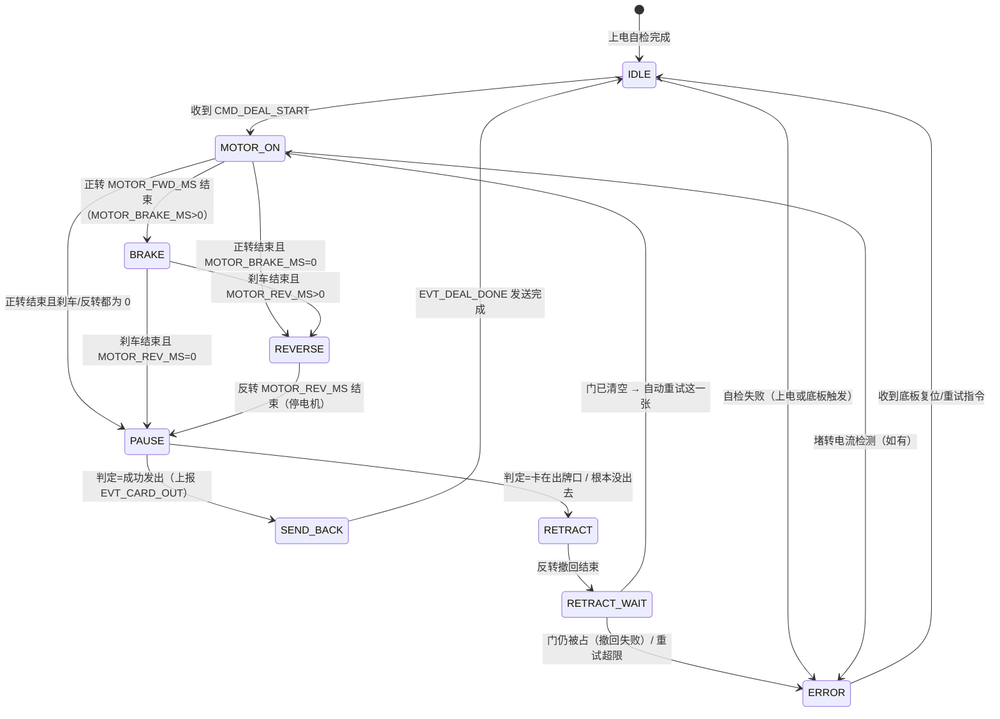

# 子板架构 v1（裸机：超级循环 + 中断）

> 版本：v1.1  
> 日期：2026-08-30  
> 状态：草稿。子板主控与摄像头模组硬件选型尚未最终确定，本文先固定**架构形态、职责边界与通信协议**；引脚映射以 `include/pins_config.h` 为准（最新版），驱动库等实现细节待硬件定型后补充。

v1.1（2026-08-30）修订：创建 `SubBoard/` PlatformIO 项目；实现串口协议（CRC8 / ACK / USB CLI 注入）；新增 RGB LED 串口调试指示；`monitor_speed` 与代码统一为 115200。

v1.2（2026-09-08）修订：引脚按最新版 `include/pins_config.h` 更新（板间 UART 改 POS/NEG，电机/光敏/摄像头引脚更新）；移除 RGB LED 调试指示，链路观察改为串口日志。

v1.3（2026-09-10）修订：定时出牌在正转与反转之间新增 BRAKE（短刹车）状态，缓解换向电流冲击；对应新增 `MOTOR_BRAKE_MS` 与 `busy_motor_brake()`。

v1.4（2026-09-10）修订：新增 `CMD_CAM_CAPTURE` 截图触发命令；子板收到后把 `PIN_CAM_TRIG` **拉低**一个脉冲（`CAM_TRIG_PULSE_MS`，OpenMV P6 下降沿触发），截图时序由底板发牌流程统一控制。

v1.5（2026-09-10）修订：子板**不主动取图**，改为接收摄像头回传：`Serial2`（PIN_CAM_RX）中断 → 环形缓冲 → 主循环解析 → 发 `EVT_CARD_VALUE`；超时未回传按 `CAM_EMPTY_ON_TIMEOUT` 发空牌（保留调试路径）。新增 `EVT_STATUS` 心跳应答（`CMD_STATUS_QUERY` 的响应）。

v1.6（2026-09-12）修订：摄像头改为 OpenMV 原生 ASCII 文本行（`RESULT:spade_A` 等），子板按行解析并翻译成牌面编码，摄像头代码不用改；触发极性改为**下降沿**（空闲高、拉低 ≥5ms）；接收方式由 `onReceive` 中断 + 环形缓冲改为**在截图等待窗口内轮询 `Serial2` 逐行解析**（避免摄像头未接时浮空引脚引发中断风暴，见 5.7）。光电门（原光敏）改为**轮询 + 去抖**：等“有牌”→ 等“无牌”确认牌完整通过；新增卡牌保护 `RETRACT`/`RETRACT_WAIT`（反转撤回，恢复则自动重试，失败则报 `EVT_ERROR_CARD_JAM` 等复位）。

v1.7（2026-09-12）修订（**开机自检落地**）：`busy_self_test()` 从“只抖一下电机”扩成完整的开机自检，只做**不需要人配合**的项目：
光电门电平读取、**摄像头校准指令下发**（新增子板 → 摄像头方向，与回传同风格 `CALIBRATE\r\n`，见 5.7）、
发牌电机微动（正转改用 `SELFTEST_MOTOR_FWD_MS`(150ms)，**明显短于出牌时长**，确保不会真的把牌发出去）、
与底板串口是否已收到数据。`EVT_READY` 从空载荷改为 **2 字节结果位图**（`SUB_ST_*`，见 protocol.h / board_protocol.md 4.2）。
自检顺序固定为“**先发摄像头校准、再转电机**”：电机一转牌就错位，会把按当前画面做的校准弄白做。
交互项（转编码器、手转电机试锁轴力矩、拿磁铁试霍尔）不在开机自检里做。

v1.8（2026-09-12）修订（**收口：文档对齐代码 + STOP/RESET 终止截图会话**）：
① 新增 `sub_camera_cancel()`，`CMD_STOP`/`CMD_RESET` 时终止截图会话（TRIG 回空闲高、清 Serial2 残留、会话状态复位）——
   否则复位后摄像头迟到的 `RESULT` 仍会被解析成 `EVT_CARD_VALUE` 上报，而那已经和下一局无关了。
② 修正本文档与代码不一致的旧描述（详见文末各节）：子板重试边界（会先自救重试，不是"立即上报不重试"）、
   `EVT_READY` 载荷（2 字节位图，不是空帧）、`CMD_DEAL_START` 载荷（无，目标牌堆由底板转到位）、
   "单卡数据缓冲"（已删除，摄像头结果直接上报）、"CRC 失败触发重传"（实际是丢弃，无重传协议）、
   "掉线时底板暂停发牌"（实际是开局前检查 + 运行中靠等待超时兜底）。

v1.9（2026-09-12）修订（**摄像头调试可观测性**）：
① 子板串口改为**原样回显摄像头发来的整行文本**（如 `[CAM] RESULT:spade_A`），不再打印解码后的 `card=/src=`；
   解码结果只进板间帧 `EVT_CARD_VALUE`，让串口日志直接反映"摄像头到底发了什么"。
② 新增子板本地调试命令 **`camcalib`**：向摄像头发一次 `CALIBRATE\r\n` 并等 `CAM_CALIB_WAIT_MS` 回应，
   用于摄像头端联调时随时验证"UART 命令接收"是否已实现，不必重启跑一遍开机自检。

v1.10（2026-09-13）修订（**光电门改为"动作期间只记录、动作结束后统一判定"**）：
① 单张牌的动作序列改成**固定时长**（不再"等牌离开光门"才换相）：
   `MOTOR_ON`(正转 `MOTOR_FWD_MS`) → `BRAKE` → `REVERSE` → `PAUSE` → 判定 → `SEND_BACK`。
   两种模式（`USE_PHOTO_SENSOR=0/1`）共用同一条流程，区别只在"要不要做判定"。
② 光电门退化成**记录器**：动作期间只采样记录"是否出现过有牌"，不做任何判断；
   动作结束、电机停稳（`PAUSE` 末尾）后再看"记录 + 当前电平"判定三种结果（见 3.4）：
   **成功发出 / 卡在出牌口 / 根本没出去**。失败的两种都走原有自救路径（反转撤回 → 重试 → 报 `EVT_ERROR_CARD_JAM`）。
③ 相应地：删除状态 `WAIT_CARD` / `WAIT_GONE`，删除 `PHOTO_TIMEOUT_MS` / `PHOTO_JAM_MS` / `MOTOR_STARTUP_MS`；
   `EVT_CARD_OUT` 的发出时机由"牌离开光门的那一刻"改为"整张动作确认成功后"。

## 一、职责定位

子板是**“带反馈的执行器”**，不是决策者：

- 只听底板命令做事：启动/停止发牌电机、采集光敏信号、驱动摄像头识别牌面、打包数据实时回传。
- 做**物理层异常检测**（光电门超时、卡牌、电机堵转电流）：先做**本地自救**（反转撤回 `RETRACT`，成功则自动重试这一张，≤ `PHOTO_JAM_RETRY_MAX` 次），自救失败才**立即上报** `EVT_ERROR_CARD_JAM`；是否继续/停机仍由底板决定。
- **业务层决策**（是否漏发/多发、是否重发、是否急停、整副牌数据组装与上传小程序）全部归底板。

## 二、架构选型：裸机，不使用 RTOS

### 2.1 工作负载分析

子板处理的是**串行流水线**：

```
收到底板指令 → 启动发牌电机 → 等待光敏触发 → 触发摄像头拍照并识别 → 打包数据回传
```

特征：

- 没有两个需要同时竞争 CPU 的重型任务；电机启动后不再占用 CPU，传感器采样与超时判断都只是主循环里的轻量轮询。
- 实时性要求集中在“及时响应底板命令”（串口 RX 中断 + 环形缓冲）和“光电门电平采样”（主循环轮询 + 去抖），两者都不需要 RTOS。
- 摄像头识别虽耗时，但主要是等待硬件就绪（OpenMV H7 Plus，UART 文本行回传，子板只接收），CPU 大部分时间空闲，用状态机等待标志位即可。

### 2.2 裸机 vs RTOS 对比

| 对比维度 | 裸机（推荐） | RTOS |
|----------|--------------|------|
| 资源占用 | 极省，内存留给图像缓冲 | 额外消耗内核 ROM/RAM 与任务栈 |
| 开发周期 | 快，状态机几小时可写完 | 需设计任务、优先级、栈、同步 |
| 可维护性 | 逻辑线性，`state` 变量一目了然 | 异步事件，排查需脑内模拟调度 |
| 稳定性 | 无栈溢出/优先级反转类内核风险 | 栈大小、优先级、内存碎片均有隐患 |
| 逻辑匹配度 | 与“启动→等待→完成”流水线天然匹配 | 需要为简单逻辑强行拆任务 |

> 结论：一个发牌电机 + 光敏 + 摄像头不满足上 RTOS 的条件（多个不同相位电机、独立网络栈、多个精确软件定时器等），子板坚决采用裸机。

## 三、状态机设计

### 3.1 状态定义

| 状态 | 含义 | 可执行操作 |
|------|------|------------|
| IDLE | 空闲，等待底板命令 | 解析串口命令、查询状态、自检 |
| MOTOR_ON | 正转出牌中 | 正转 `MOTOR_FWD_MS`；**期间只记录光电门**，不做任何判断 |
| BRAKE | 正转→反转过渡 | 短刹车 `MOTOR_BRAKE_MS`（AIN1=AIN2=高，PWM=0）；继续记录光电门 |
| REVERSE | 出牌后反转回退 | 反转 `MOTOR_REV_MS`（把下一张退到摄像头可拍位置）；继续记录光电门 |
| PAUSE | 动作收尾停顿 + 判定窗口 | 停电机、等 `MOTOR_PAUSE_MS`；**结束时判定这一张**（见 3.4） |
| RETRACT | 判失败（卡住/没出去）：反转撤回 | 反转 `PHOTO_RETRACT_MS` 把牌退回 |
| RETRACT_WAIT | 撤回后等门清空 | 门恢复“无牌” → 自动重试这一张；`PHOTO_CLEAR_MS` 内仍“有牌” → ERROR |
| ~~CAM_CAPTURE~~ | **不占状态机状态** | 截图触发 + 回传解析在 `hardware.cpp` 的“截图会话”里独立完成（见 5.7），状态机只管电机/光电门流程 |
| SEND_BACK | 打包回传底板 | 组装事件帧发送，完成后回到 IDLE |
| ERROR | 物理层异常 | 立即上报错误事件，停止电机，等待底板指令（重试/复位） |

### 3.2 状态转移图



> 单张动作序列对两种模式都一样：`MOTOR_ON → BRAKE → REVERSE → PAUSE`，
> 其中 `MOTOR_BRAKE_MS=0` 跳过 BRAKE、`MOTOR_REV_MS=0` 跳过 REVERSE。
> `USE_PHOTO_SENSOR=0`（没有光电门）时 `PAUSE` 里直接按"成功发出"处理，不做判定。

### 3.3 转移条件与动作表

| 转移 | 触发条件 | 动作 |
|------|----------|------|
| IDLE → MOTOR_ON | 收到 `CMD_DEAL_START` | 启动发牌电机正转 |
| IDLE → MOTOR_ON | 收到 `CMD_DEAL_START` | 启动正转出牌；**清空光电门记录**开始记录 |
| MOTOR_ON → BRAKE | 正转 `MOTOR_FWD_MS` 结束且 `MOTOR_BRAKE_MS>0` | 短刹车（缓解换向电流冲击） |
| MOTOR_ON → REVERSE | 正转结束、`MOTOR_BRAKE_MS=0` 且 `MOTOR_REV_MS>0` | 启动反转回退 |
| MOTOR_ON → PAUSE | 正转结束、刹车与反转都为 0 | 停电机，进入判定 |
| BRAKE → REVERSE | 刹车 `MOTOR_BRAKE_MS` 结束且 `MOTOR_REV_MS>0` | 启动反转回退 |
| BRAKE → PAUSE | 刹车结束且 `MOTOR_REV_MS=0` | 停电机，进入判定 |
| REVERSE → PAUSE | 反转 `MOTOR_REV_MS` 结束 | 停电机，进入判定前的稳定窗口 |
| PAUSE → SEND_BACK | 停顿 `MOTOR_PAUSE_MS` 结束，判定 = **成功发出** | 上报 `EVT_CARD_OUT` |
| PAUSE → RETRACT | 判定 = **卡在出牌口** 或 **根本没出去** | 先停正转，再反转撤回 |
| RETRACT → RETRACT_WAIT | 反转 `PHOTO_RETRACT_MS` 结束 | 停电机，等门恢复“无牌” |
| RETRACT_WAIT → MOTOR_ON | 门恢复“无牌”且在重试次数内 | 自动重试这一张（≤ `PHOTO_JAM_RETRY_MAX`） |
| RETRACT_WAIT → ERROR | `PHOTO_CLEAR_MS` 内仍“有牌”，或重试超限 | 停止电机；上报 `EVT_ERROR_CARD_JAM` |
| （截图会话，非状态机状态） | 收到合法回传 / 等 `CAM_RESULT_TIMEOUT_MS` 超时 | `hardware.cpp` 直接发 `EVT_CARD_VALUE [card, src]`（不回 IDLE，不影响状态机） |
| SEND_BACK → IDLE | 事件帧发送完成 | 发送 `EVT_DEAL_DONE`，回到待命（牌面已由摄像头路径直接上报，没有单卡缓冲需要清） |
| ERROR → IDLE | 收到底板复位/重试指令 | 复位状态机，重新待命 |

### 3.4 光电门记录与发牌结果判定（v1.10）

动作期间（`MOTOR_ON`/`BRAKE`/`REVERSE`）**只记录、不判断**：每个主循环 tick 采样一次去抖后的电平，
只要出现过"有牌"就置位 `seenPresent`。

动作结束、电机停稳后（`PAUSE` 末尾）用"记录 + 当前电平"判定三种结果：

| 动作中见过"有牌" | 结束时的电平 | 判定 | 应对 |
|---|---|---|---|
| 否 | 无牌 | **根本没出去**（漏发 / 卡在牌源里） | 反转撤回 → 重试 → 仍失败则报 `EVT_ERROR_CARD_JAM` |
| 是 | 有牌 | **卡在出牌口** | 反转撤回 → 重试 → 仍失败则报 `EVT_ERROR_CARD_JAM` |
| 是 | 无牌 | **成功发出** | 上报 `EVT_CARD_OUT`，继续下一张 |

设计说明：

- `PAUSE` 的 `MOTOR_PAUSE_MS`(100ms) 兼作**判定前的稳定窗口**：电机已停、牌堆复位，
  避免"下一张牌微微露头又缩回"这类瞬态被误判成卡住；电平本身已由 `PHOTO_DEBOUNCE_MS`(20ms) 去抖。
- 两种失败**走同一条自救路径**（反转撤回 → 等门清空 → 重试 ≤ `PHOTO_JAM_RETRY_MAX` 次 → 报错），
  与既有方案一致；等门清空用 `PHOTO_GONE_MS`，整段上限 `PHOTO_CLEAR_MS`。
- 判定挪到动作之后，`EVT_CARD_OUT` 的发出时机从"牌离开光门的那一刻"变成"整张动作确认成功后"；
  对底板语义不变（仍是"这一张成功发出"），`EVT_CARD_OUT` → `EVT_DEAL_DONE` 的顺序也不变。
- ⚠️ 正转时长 `MOTOR_FWD_MS`(390ms) 现在是**唯一的推进时长**，必须保证能把一张牌完整推过出牌口并留余量；
  太短会把"还在路上"的牌误判成卡住（随后被反转拉回来）。实机需按出牌速度重新确认这个值。

## 四、中断与定时器设计

| 中断/定时器 | 用途 | 说明 |
|-------------|------|------|
| 串口 RX 中断 | 接收底板命令 | 中断内只写入环形缓冲区，主循环解析，避免丢帧 |
| 光电门轮询（不用中断） | 检测牌是否在出牌口 | 主循环 `sub_photo_update()` 采样 + `PHOTO_DEBOUNCE_MS` 去抖；有牌=低电平。v1.10 起**动作期间只记录**，判定放到动作结束后（见 3.4） |
| 软件超时定时器 | 动作各阶段 / 撤回 / 判定 | 靠 `millis()` 推进 `MOTOR_FWD_MS` / `MOTOR_BRAKE_MS` / `MOTOR_REV_MS` / `MOTOR_PAUSE_MS`；`PHOTO_RETRACT_MS` 撤回、`PHOTO_CLEAR_MS` 撤回后仍未清空 |
| 串口 TX | 事件上报 | 逐张实时上报，不缓存整副牌 |
| 摄像头 TRIG 输出 | 截图触发 | 收到 `CMD_CAM_CAPTURE` 后把 `PIN_CAM_TRIG` **拉低** `CAM_TRIG_PULSE_MS`（OpenMV P6 下降沿触发），再恢复高 |
| 电流检测（如有） | 发牌电机堵转 | 模拟输入或驱动芯片报警脚，异常立即上报 |

> 设计原则：中断函数内**不做耗时操作**（不识别图像、不解析协议），只置标志位/写缓冲；全部业务在 `loop()` 状态机中处理。

## 五、与底板的通信协议

### 5.1 物理层

- 通道：滑环串口（POS 连 POS、NEG 连 NEG + 共地；**具体引脚见两板 `include/pins_config.h`**，当前按 2 线普通 UART 处理）。
- **必须共地**：两板 POS/NEG 之外必须连接 GND；板间串口不要占用 UART0（GPIO43/44，CH340 调试口）。
- 可靠性：**必须带 CRC 校验**；数据包分小段发送；校验失败的帧**直接丢弃**（当前**没有重传协议**：靠"下一张牌的周期"自然恢复 + 底板各项等待超时兜底）；长时间无通信按掉线处理（见第七章）。

### 5.2 帧格式（已定稿）

```
帧头(0xA5) | 类型(1B) | 长度(1B) | 数据(nB) | CRC(1B) | 帧尾(0xAA)
```

> CRC-8 算法、命令/事件表、ACK 与 CLI 注入的完整定义见 [board_protocol.md](board_protocol.md)。

### 5.3 命令（底板 → 子板）

| 命令 | 数据 | 说明 |
|------|------|------|
| `CMD_DEAL_START` | 无（当前忽略一切载荷） | 启动发牌电机发一张牌；**目标牌堆由底板自己转到位**，子板不需要知道序号 |
| `CMD_STOP` | — | 停止电机 / 急停 |
| `CMD_STATUS_QUERY` | — | 查询当前状态与计数 |
| `CMD_SELF_TEST` | — | 触发自检（光敏、电机驱动、摄像头） |
| `CMD_RESET` | — | 复位状态机（从 ERROR 恢复） |
| `CMD_CAM_CAPTURE` | — | 触发一次摄像头截图（把 `PIN_CAM_TRIG` **拉低**一个脉冲，OpenMV P6 下降沿触发） |

### 5.4 事件（子板 → 底板）

| 事件 | 数据 | 说明 |
|------|------|------|
| `EVT_READY` | `[bitsLo, bitsHi]`（2 字节位图 `SUB_ST_*`） | 自检完成：开机自检与 `CMD_SELF_TEST` 复检都会发（位定义见 [board_protocol.md](board_protocol.md) 4.2） |
| `EVT_CARD_OUT` | 无（空载荷） | 这一张**确认成功发出**（动作跑完、电机停稳后按光电门记录判定，见 3.4） |
| `EVT_CARD_VALUE` | `[card, src]` | 牌面识别结果：`card` = 牌面编码 0~55、`src` = 来源（见 [board_protocol.md](board_protocol.md) 4.1） |
| `EVT_DEAL_DONE` | 无（空载荷） | 单张发牌流程完成 |
| `EVT_ERROR_CARD_JAM` | 无（空载荷） | 卡在出牌口 / 根本没出去，且撤回重试后仍失败，**立即上报** |
| `EVT_ERROR_MOTOR_STALL` | 无（空载荷） | 发牌电机堵转（**未实装**：TB6612 无电流检测脚） |
| `EVT_ERROR_CAM_FAIL` | 无（空载荷） | 摄像头回 `RESULT:ERROR`，或超时且 `CAM_EMPTY_ON_TIMEOUT=0` |
| `EVT_STATUS` | [state, error, countLo, countHi] | 状态回执：`CMD_STATUS_QUERY` 的应答（心跳） |

### 5.5 实时上报原则（重点）

1. **发一张、传一张**：子板内存中只需保留当前这一张牌的信息，不缓存整副牌。
2. 光敏触发后立即发 `EVT_CARD_OUT`；识别完成后立即发 `EVT_CARD_VALUE`，顺序天然一致，无需复杂流水号。
3. 异常（卡牌超时/堵转）**第一时间上报**，等待底板决策，而不是攒到最后。
4. 整副牌数据的拼装与统一上传小程序是底板职责。

### 5.6 串口调试辅助

最新版硬件配置已移除调试 RGB LED（`pins_config.h` 中无 `PIN_LED_*`），链路观察改为串口日志：收到任意字节/完整帧/回发 ACK 都会在调试串口打印（见 [board_protocol.md](board_protocol.md)），USB 串口手动注入命令同样会回显解析结果。

### 5.7 摄像头：截图触发 / 回传接收 / 指令下发

子板收到 `CMD_CAM_CAPTURE` 后只做两件事：把 `PIN_CAM_TRIG` **拉低** `CAM_TRIG_PULSE_MS`（OpenMV P6 是**下降沿**触发，空闲为高），然后等待摄像头把识别结果**发回来**。

接收链路：`Serial2`（`PIN_CAM_RX`，摄像头 TX → 子板 RX）由主循环 `sub_camera_service()` 在等待窗口内**轮询**并按行解析（不用 onReceive 中断，避免摄像头未接时浮空引脚触发中断风暴）→ 发 `EVT_CARD_VALUE`。

回传格式（已确定，摄像头端**不用改代码**，直接用 OpenMV 原生 ASCII 文本行）：

```
RESULT:<结果>\r\n
  spade_A / heart_10 / club_K / diamond_3   普通牌（花色_点数）
  joker_big / joker_small                   大小王
  back                                      只有牌背
  UNKNOWN                                   置信度不足
  ERROR                                     摄像头自身异常
```

子板把文本翻译成内部牌面编码（`code = 花色×13 + 点数`，花色顺序黑桃 0 / 红桃 1 / 梅花 2 / 方块 3，小王 52 / 大王 53 / 背面 54 / 未知 55），再按板间二进制帧发 `EVT_CARD_VALUE`（`data = [card, src]`）。帧格式与示例见 [camera_protocol.md](camera_protocol.md)。

超时处理：触发后 `CAM_RESULT_TIMEOUT_MS`(1.2s) 内未收到合法回传 → `CAM_EMPTY_ON_TIMEOUT=1` 时发 `EVT_CARD_VALUE [CARD_UNKNOWN(55), CARD_SRC_TIMEOUT(1)]`（不是空帧；保留“发空牌”调试路径，整条流程仍可跑通）；改为 0 则上报 `EVT_ERROR_CAM_FAIL`。

**反方向（子板 → 摄像头）**：用同一根 UART（`PIN_CAM_TX` → 摄像头 RX/P5）、同一套格式风格
——ASCII 文本行 + `\r\n` 结尾。当前只有一条指令，用于开机自检的摄像头校准：

```
CALIBRATE\r\n          // 子板 sub_camera_calibrate() 发出，随后等 CAM_CALIB_WAIT_MS(1.5s) 收回应
```

- 指令内容在 `app_config.h` 的 `CAM_CMD_CALIBRATE` 一处定义，改字符串即可；
- 联调入口：子板串口敲 **`camcalib`**（子板本地命令，不进协议）即可手动发一次并打印回应，不必重启；
- 摄像头端**目前不读 UART**（`重要信息/STANDALONE_IO_PROTOCOL(1).md` 第 7 节），需要加接收处理后才生效；
  在那之前自检只打印 `[CAM] calibrate: no reply`，`SUB_ST_CAM_CALIB` 位留 0，**不算失败**；
- 详细格式、回应约定、联调步骤见 [camera_protocol.md](camera_protocol.md) 第 7 节。
- 注意：`PIN_CAM_TRIG`(GPIO20) 与 `PIN_CAM_TX`(GPIO10) 是两回事——下发指令**不需要**碰 TRIG，
  所以自检里只初始化 UART，不动 GPIO20（它是原生 USB 的 D+，一动原生 USB 日志就没了）。
- **串口日志约定**：子板把摄像头**发来的整行原文**原样回显（前缀 `[CAM] `），不打印解码后的 `card/src`；
  解码结果只进板间帧 `EVT_CARD_VALUE`。排查摄像头时能直接看到它到底发了什么。

## 六、数据与内存设计

- **不缓存牌面**：摄像头结果由 `sub_camera_service()` 翻译成牌面编码后**直接**发 `EVT_CARD_VALUE`，子板内存里**没有**单卡缓冲，也没有历史数组（整副牌的拼装是底板职责）。
- **静态分配**：图像缓冲使用静态大数组复用，避免频繁 `malloc/free` 造成堆碎片。
- **摄像头帧缓冲**：若摄像头驱动需要较大缓冲，裸机架构下可独占大部分 RAM（这是不用 RTOS 的额外收益）。

## 七、异常处理

| 检查类型 | 谁检测 | 上报时机 | 底板决策 |
|----------|--------|----------|----------|
| 卡牌 / 没出去 | 子板（动作结束后的光门判定，见 3.4；反转撤回 + 重试一次） | 自救无效才发 `EVT_ERROR_CARD_JAM` | 停机等复位，屏幕显示错误 |
| 发牌电机堵转 | 子板（电流检测/超时） | 立即发 `EVT_ERROR_MOTOR_STALL` | 停止或急停，进入错误状态 |
| 摄像头识别失败 | 子板（`CAM_RESULT_TIMEOUT_MS` 1.2s 超时 / OpenMV 回 `RESULT:UNKNOWN`） | 标为未知牌：发 `EVT_CARD_VALUE [55, src]`（超时 `src=1`、低置信度 `src=2`）；若摄像头回 `RESULT:ERROR` 或 `CAM_EMPTY_ON_TIMEOUT=0`，改发 `EVT_ERROR_CAM_FAIL` | 记录异常，整局结束后向小程序报告 |
| 串口掉线 | 底板监控任务（心跳 `CMD_STATUS_QUERY` / `EVT_STATUS` + `COMM_DEAD_TIMEOUT_MS` 3s 阈值） | 掉线时串口打印 `[MON] sub board OFFLINE`，后续新局开局被拒 | **开局前**检查：不在线直接拒绝启动并报 `sub offline`；**运行中**掉线不做立即暂停，由各等待超时（牌面/出牌/单张完成）兜底 |

## 八、启动与自检流程

1. 硬件初始化：GPIO、PWM、串口、摄像头接口。
2. 开机自检 `busy_self_test()`，顺序固定（每一步都写进串口日志，结果写进 `SUB_ST_*` 位图）：

   | 步骤 | 内容 | 判定 | 位 |
   |------|------|------|----|
   | ① | 读一次光电门电平 | 能读到即算这项可用（电平高低要对着现场看） | `SUB_ST_PHOTO` |
   | ② | **发摄像头校准指令**并等回应（`CAM_CALIB_WAIT_MS` 1.5s） | 收到回应且非 `RESULT:ERROR` | `SUB_ST_CAM_CALIB` / `SUB_ST_CAM_UART` |
   | ③ | 发牌电机微动（正转 150ms → 刹车 → 反转 300ms） | **人眼/听声确认**抖了两下 | `SUB_ST_MOTOR` |
   | ④ | 再读一次光电门（对比 ①，看牌有没有被推动） | 可观察项 | — |
   | ⑤ | 查与底板串口：自检期间是否收到过底板数据 | 收到即置位（底板还没启动时可 0） | `SUB_ST_HOST_UART` |

3. 上报 `EVT_READY`（`data` = 2 字节结果位图）给底板。
4. 进入 IDLE，等待底板命令。

> 自检里**不做**需要人配合的项（转编码器、按编码器、手转电机试锁轴力矩、拿磁铁试霍尔）——
> 这些留给以后的交互式复检模式。底板侧可用 `CMD_SELF_TEST` 让子板重跑上述自检并重新上报 `EVT_READY`。

## 九、主循环伪代码框架

> 实际实现见 `SubBoard/src/main.cpp`（主循环）与 `src/state_machine.cpp`（状态机）；
> 下面是与当前代码一致的骨架（v1.10 起：动作期间光电门**只记录**，判定放到动作结束后）。

```cpp
// 单张动作：MOTOR_ON → BRAKE → REVERSE → PAUSE → 判定 → SEND_BACK
// 失败：PAUSE → RETRACT → RETRACT_WAIT →（重试 MOTOR_ON / ERROR）
enum { STATE_IDLE, STATE_MOTOR_ON, STATE_BRAKE, STATE_REVERSE, STATE_PAUSE,
       STATE_RETRACT, STATE_RETRACT_WAIT, STATE_SEND_BACK, STATE_ERROR } state;

bool seenPresent;                  // 动作期间是否出现过“有牌”（只记录）
int  retry;                        // 本张牌已重试次数

void loop() {
    parse_uart_command();          // 串口 RX 中断写环形缓冲 → 这里解析并分发
    sub_camera_service();          // 摄像头回传解析（截图会话，不占状态机状态）
    sub_photo_update();            // 光电门采样 + 去抖

    switch (state) {
    case STATE_IDLE:
        if (cmd == CMD_DEAL_START) { retry = 0; seenPresent = false; start_motor(); state = STATE_MOTOR_ON; }
        if (cmd == CMD_SELF_TEST)  { run_self_test(); }
        break;

    case STATE_MOTOR_ON:           // 正转：只记录，不判断
        if (photo_present()) seenPresent = true;
        if (elapsed() >= MOTOR_FWD_MS) { brake(); state = STATE_BRAKE; }
        break;

    case STATE_BRAKE:
        if (photo_present()) seenPresent = true;
        if (elapsed() >= MOTOR_BRAKE_MS) { reverse(); state = STATE_REVERSE; }
        break;

    case STATE_REVERSE:
        if (photo_present()) seenPresent = true;
        if (elapsed() >= MOTOR_REV_MS) { stop_motor(); state = STATE_PAUSE; }
        break;

    case STATE_PAUSE:              // 电机已停稳 → 判定这一张（见 3.4）
        if (elapsed() >= MOTOR_PAUSE_MS) {
            // 没有光电门时（USE_PHOTO_SENSOR=0）直接按 OUT 处理
            if (photo_present())   result = STUCK;    // 门口还压着牌
            else if (!seenPresent) result = MISSED;   // 全程没见过牌
            else                   result = OUT;      // 见过、现在没了
            if (result == OUT) { send_event(EVT_CARD_OUT); state = STATE_SEND_BACK; }
            else               { reverse(); state = STATE_RETRACT; }
        }
        break;

    case STATE_RETRACT:            // 反转撤回
        if (elapsed() >= PHOTO_RETRACT_MS) { stop_motor(); state = STATE_RETRACT_WAIT; }
        break;

    case STATE_RETRACT_WAIT:       // 等门清空 → 重试；超时/超次数 → ERROR
        if (!photo_present() && stable_ms() >= PHOTO_GONE_MS) {
            if (++retry <= PHOTO_JAM_RETRY_MAX) { seenPresent = false; start_motor(); state = STATE_MOTOR_ON; }
            else                                { send_event(EVT_ERROR_CARD_JAM); state = STATE_ERROR; }
        } else if (elapsed() >= PHOTO_CLEAR_MS) {
            send_event(EVT_ERROR_CARD_JAM);
            state = STATE_ERROR;
        }
        break;

    case STATE_SEND_BACK:
        send_event(EVT_DEAL_DONE);     // 牌面 EVT_CARD_VALUE 由摄像头路径单独上报
        state = STATE_IDLE;
        break;

    case STATE_ERROR:
        if (cmd == CMD_RESET || cmd == CMD_STOP) { stop_motor(); state = STATE_IDLE; }
        break;
    }
}
```

## 十、与仓库结构的关系及落地清单

`SubBoard/` PlatformIO 项目已创建（结构参照 `BottomBoard/`：`src/`、`include/`、`platformio.ini`），已实现：裸机状态机骨架、串口协议解析/回发 ACK、USB CLI 注入、串口链路日志；`platformio.ini` 已配置 `monitor_speed = 115200`（与代码 `Serial.begin(115200)` 一致）。

### 落地前需确认

1. ~~**子板主控选型**~~ → 已定：ESP32-S3-WROOM-1-N16R8（引脚映射见 `SubBoard/include/pins_config.h`）。
2. ~~**摄像头模组**~~ → 已定：OpenMV H7 Plus，自带识别，UART 回传文本行（见 [camera_protocol.md](camera_protocol.md)）。
3. ~~**协议帧格式定稿**~~ → 已定：与底板第七章对齐，见 [board_protocol.md](board_protocol.md)。
4. ~~**光敏传感器安装与触发电平**~~ → 已定：改用光电门，**有牌 = 低电平（GND）**、无牌 = 高；采样为**电平轮询 + 去抖**（不是中断/边沿），参数见 `app_config.h` 的 `PHOTO_DEBOUNCE_MS` / `PHOTO_GONE_MS`。
5. **发牌电机驱动**：TB6612 已实测可用；**堵转电流检测脚未接**，堵转只能靠"动作结束后的光电门判定 + 撤回重试"间接判断。
