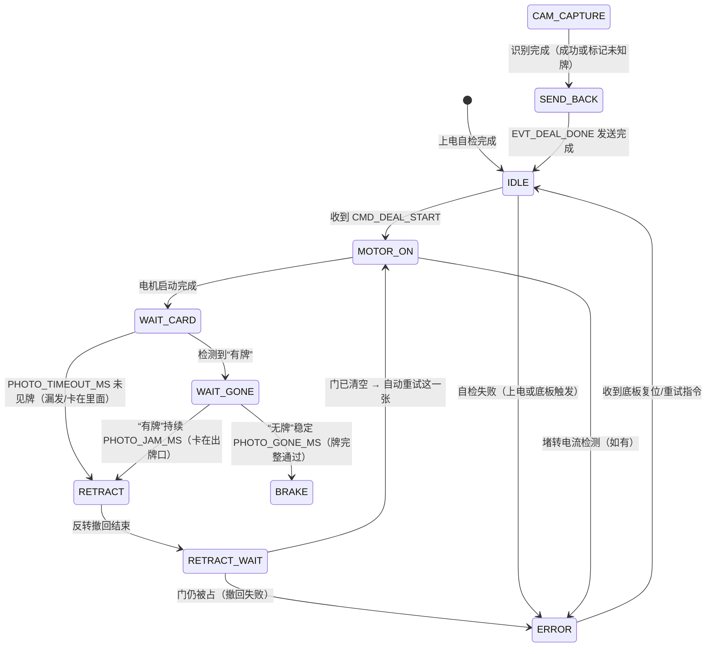

# 子板架构 v1（裸机：超级循环 + 中断）

> 版本：v1.1  
> 日期：2026-08-30  
> 状态：草稿。子板主控与摄像头模组硬件选型尚未最终确定，本文先固定**架构形态、职责边界与通信协议**；引脚映射以 `include/pins_config.h` 为准（最新版），驱动库等实现细节待硬件定型后补充。

v1.1（2026-08-30）修订：创建 `SubBoard/` PlatformIO 项目；实现串口协议（CRC8 / ACK / USB CLI 注入）；新增 RGB LED 串口调试指示；`monitor_speed` 与代码统一为 115200。

v1.2（2026-09-08）修订：引脚按最新版 `include/pins_config.h` 更新（板间 UART 改 POS/NEG，电机/光敏/摄像头引脚更新）；移除 RGB LED 调试指示，链路观察改为串口日志。

v1.3（2026-09-10）修订：定时出牌在正转与反转之间新增 BRAKE（短刹车）状态，缓解换向电流冲击；对应新增 `MOTOR_BRAKE_MS` 与 `busy_motor_brake()`。

v1.4（2026-09-10）修订：新增 `CMD_CAM_CAPTURE` 截图触发命令；子板收到后拉高 `PIN_CAM_TRIG` 一个脉冲（`CAM_TRIG_PULSE_MS`），截图时序由底板发牌流程统一控制。

v1.5（2026-09-10）修订：子板**不主动取图**，改为接收摄像头回传：`Serial2`（PIN_CAM_RX）中断 → 环形缓冲 → 主循环解析 → 发 `EVT_CARD_VALUE`；超时未回传按 `CAM_EMPTY_ON_TIMEOUT` 发空牌（保留调试路径）。新增 `EVT_STATUS` 心跳应答（`CMD_STATUS_QUERY` 的响应）。

v1.6（2026-09-12）修订：摄像头改为 OpenMV 原生 ASCII 文本行（`RESULT:spade_A` 等），子板按行解析并翻译成牌面编码，摄像头代码不用改；触发极性改为**下降沿**（空闲高、拉低 ≥5ms）。光电门（原光敏）改为**轮询 + 去抖**：等“有牌”→ 等“无牌”确认牌完整通过；新增卡牌保护 `RETRACT`/`RETRACT_WAIT`（反转撤回，恢复则自动重试，失败则报 `EVT_ERROR_CARD_JAM` 等复位）。

## 一、职责定位

子板是**“带反馈的执行器”**，不是决策者：

- 只听底板命令做事：启动/停止发牌电机、采集光敏信号、驱动摄像头识别牌面、打包数据实时回传。
- 只做**物理层异常检测**（光敏超时、卡牌、电机堵转电流），检测到后**立即上报**，不做重试/停止等业务决策。
- **业务层决策**（是否漏发/多发、是否重发、是否急停、整副牌数据组装与上传小程序）全部归底板。

## 二、架构选型：裸机，不使用 RTOS

### 2.1 工作负载分析

子板处理的是**串行流水线**：

```
收到底板指令 → 启动发牌电机 → 等待光敏触发 → 触发摄像头拍照并识别 → 打包数据回传
```

特征：

- 没有两个需要同时竞争 CPU 的重型任务；电机启动后不再占用 CPU，传感器等待走中断。
- 实时性要求集中在“及时响应底板命令”和“光敏触发捕获”，两者用中断即可满足。
- 摄像头识别虽耗时，但主要是等待硬件就绪（接口按 UART 预留，型号待定），CPU 大部分时间空闲，用状态机等待标志位即可。

### 2.2 裸机 vs RTOS 对比

| 对比维度 | 裸机（推荐） | RTOS |
|----------|--------------|------|
| 资源占用 | 极省，内存留给图像缓冲 | 额外消耗内核 ROM/RAM 与任务栈 |
| 开发周期 | 快，状态机几小时可写完 | 需设计任务、优先级、栈、同步 |
| 可维护性 | 逻辑线性，`state` 变量一目了然 | 异步事件，排查需脑内模拟调度 |
| 稳定性 | 无栈溢出/优先级反转类内核风险 | 栈大小、优先级、内存碎片均有隐患 |
| 逻辑匹配度 | 与“启动→等待→完成”流水线天然匹配 | 需要为简单逻辑强行拆任务 |

> 结论：一个发牌电机 + 光敏 + 摄像头不满足上 RTOS 的条件（多个不同相位电机、独立网络栈、多个精确软件定时器等），子板坚决采用裸机。

## 三、状态机设计

### 3.1 状态定义

| 状态 | 含义 | 可执行操作 |
|------|------|------------|
| IDLE | 空闲，等待底板命令 | 解析串口命令、查询状态、自检 |
| MOTOR_ON | 发牌电机启动中 | 启动电机，启动 500ms 超时计时 |
| BRAKE | 正转→反转过渡 | 短刹车 `MOTOR_BRAKE_MS`（AIN1=AIN2=高，PWM=0；定时模式） |
| WAIT_CARD | 光电门模式：等“有牌” | 轮询去抖后的电平；`PHOTO_TIMEOUT_MS` 仍未见牌 → 判卡 |
| WAIT_GONE | 光电门模式：等“无牌”确认牌通过 | “无牌”稳定 `PHOTO_GONE_MS` → 上报 `EVT_CARD_OUT`；“有牌”持续 `PHOTO_JAM_MS` → 判卡 |
| RETRACT | 卡牌：反转撤回 | 反转 `PHOTO_RETRACT_MS` 把牌退回 |
| RETRACT_WAIT | 撤回后等门清空 | 门恢复“无牌” → 自动重试这一张；`PHOTO_CLEAR_MS` 内仍“有牌” → ERROR |
| CAM_CAPTURE | 摄像头拍照 + 识别 | 触发拍照、读取图像、识别牌面（含 2s 超时） |
| SEND_BACK | 打包回传底板 | 组装事件帧发送，完成后回到 IDLE |
| ERROR | 物理层异常 | 立即上报错误事件，停止电机，等待底板指令（重试/复位） |

### 3.2 状态转移图



> 定时模式（`USE_PHOTO_SENSOR=0`）在 `MOTOR_ON` 之后插入刹车与回退：
> `MOTOR_ON → BRAKE → REVERSE → PAUSE → SEND_BACK`，其中 `MOTOR_BRAKE_MS=0` 时跳过 BRAKE。

### 3.3 转移条件与动作表

| 转移 | 触发条件 | 动作 |
|------|----------|------|
| IDLE → MOTOR_ON | 收到 `CMD_DEAL_START` | 启动发牌电机正转 |
| MOTOR_ON → WAIT_CARD | 光电门模式，电机启动 `MOTOR_STARTUP_MS` 后 | 等待“有牌” |
| MOTOR_ON → BRAKE | 定时模式正转结束 | 上报 `EVT_CARD_OUT`；短刹车 `MOTOR_BRAKE_MS` |
| BRAKE → REVERSE | 刹车结束且 `MOTOR_REV_MS>0` | 启动反转回退 |
| BRAKE → PAUSE | 刹车结束且 `MOTOR_REV_MS=0` | 停止电机，进入停顿 |
| WAIT_CARD → WAIT_GONE | 去抖后检测到“有牌” | 继续等牌离开 |
| WAIT_CARD → RETRACT | `PHOTO_TIMEOUT_MS` 内一直“无牌” | 判为漏发/卡住 → 反转撤回 |
| WAIT_GONE → BRAKE | “无牌”稳定 `PHOTO_GONE_MS` | 牌完整通过：停电机、上报 `EVT_CARD_OUT`、短刹车 |
| WAIT_GONE → RETRACT | “有牌”持续 `PHOTO_JAM_MS` | 判为卡在出牌口 → 反转撤回 |
| RETRACT → RETRACT_WAIT | 反转 `PHOTO_RETRACT_MS` 结束 | 停电机，等门恢复“无牌” |
| RETRACT_WAIT → MOTOR_ON | 门恢复“无牌”且在重试次数内 | 自动重试这一张（≤ `PHOTO_JAM_RETRY_MAX`） |
| RETRACT_WAIT → ERROR | `PHOTO_CLEAR_MS` 内仍“有牌”，或重试超限 | 停止电机；上报 `EVT_ERROR_CARD_JAM` |
| CAM_CAPTURE → SEND_BACK | 识别完成（该状态当前不由状态机进入） | 组装 `EVT_CARD_VALUE`（含未知牌标志） |
| SEND_BACK → IDLE | 事件帧发送完成 | 清空单卡缓冲，回到待命 |
| ERROR → IDLE | 收到底板复位/重试指令 | 复位状态机，重新待命 |

## 四、中断与定时器设计

| 中断/定时器 | 用途 | 说明 |
|-------------|------|------|
| 串口 RX 中断 | 接收底板命令 | 中断内只写入环形缓冲区，主循环解析，避免丢帧 |
| 光电门轮询（不用中断） | 检测牌是否在出牌口 | 主循环 `sub_photo_update()` 采样 + `PHOTO_DEBOUNCE_MS` 去抖；有牌=低电平 |
| 软件超时定时器 | 等牌 / 卡牌 / 撤回超时 | `PHOTO_TIMEOUT_MS`（未见牌）、`PHOTO_JAM_MS`（卡在门口）、`PHOTO_CLEAR_MS`（撤回后未清空） |
| 串口 TX | 事件上报 | 逐张实时上报，不缓存整副牌 |
| 摄像头 TRIG 输出 | 截图触发 | 收到 `CMD_CAM_CAPTURE` 后把 `PIN_CAM_TRIG` **拉低** `CAM_TRIG_PULSE_MS`（OpenMV P6 下降沿触发），再恢复高 |
| 电流检测（如有） | 发牌电机堵转 | 模拟输入或驱动芯片报警脚，异常立即上报 |

> 设计原则：中断函数内**不做耗时操作**（不识别图像、不解析协议），只置标志位/写缓冲；全部业务在 `loop()` 状态机中处理。

## 五、与底板的通信协议

### 5.1 物理层

- 通道：滑环串口（底板 POS=IO45 TX / NEG=IO48 RX 对端；子板 POS=IO38 RX / NEG=IO39 TX；POS 连 POS、NEG 连 NEG，**当前按 2 线普通 UART 处理**）。
- **必须共地**：两板 POS/NEG 之外必须连接 GND；板间串口不要占用 UART0（GPIO43/44，CH340 调试口）。
- 可靠性：**必须带 CRC 校验**；数据包分小段发送；校验失败丢弃并触发重传；长时间无通信按掉线处理。

### 5.2 帧格式（已定稿）

```
帧头(0xA5) | 类型(1B) | 长度(1B) | 数据(nB) | CRC(1B) | 帧尾(0xAA)
```

> CRC-8 算法、命令/事件表、ACK 与 CLI 注入的完整定义见 [board_protocol.md](board_protocol.md)。

### 5.3 命令（底板 → 子板）

| 命令 | 数据 | 说明 |
|------|------|------|
| `CMD_DEAL_START` | 目标牌堆/序号 | 启动发牌电机发一张牌 |
| `CMD_STOP` | — | 停止电机 / 急停 |
| `CMD_STATUS_QUERY` | — | 查询当前状态与计数 |
| `CMD_SELF_TEST` | — | 触发自检（光敏、电机驱动、摄像头） |
| `CMD_RESET` | — | 复位状态机（从 ERROR 恢复） |
| `CMD_CAM_CAPTURE` | — | 触发一次摄像头截图（拉高 `PIN_CAM_TRIG` 一个脉冲） |

### 5.4 事件（子板 → 底板）

| 事件 | 数据 | 说明 |
|------|------|------|
| `EVT_READY` | 自检结果 | 上电自检完成，进入待命 |
| `EVT_CARD_OUT` | 成功标志 | 光敏检测到一张牌发出 |
| `EVT_CARD_VALUE` | 牌序号、花色、点数、未知牌标志 | 牌面识别结果 |
| `EVT_DEAL_DONE` | — | 单张发牌流程完成 |
| `EVT_ERROR_CARD_JAM` | 超时值 | 光敏超时/卡牌，**立即上报** |
| `EVT_ERROR_MOTOR_STALL` | 电流/时间 | 发牌电机堵转（如支持检测） |
| `EVT_ERROR_CAM_FAIL` | 错误码 | 摄像头识别失败（该张标记为未知牌） |
| `EVT_STATUS` | [state, error, countLo, countHi] | 状态回执：`CMD_STATUS_QUERY` 的应答（心跳） |

### 5.5 实时上报原则（重点）

1. **发一张、传一张**：子板内存中只需保留当前这一张牌的信息，不缓存整副牌。
2. 光敏触发后立即发 `EVT_CARD_OUT`；识别完成后立即发 `EVT_CARD_VALUE`，顺序天然一致，无需复杂流水号。
3. 异常（卡牌超时/堵转）**第一时间上报**，等待底板决策，而不是攒到最后。
4. 整副牌数据的拼装与统一上传小程序是底板职责。

### 5.6 串口调试辅助

最新版硬件配置已移除调试 RGB LED（`pins_config.h` 中无 `PIN_LED_*`），链路观察改为串口日志：收到任意字节/完整帧/回发 ACK 都会在调试串口打印（见 [board_protocol.md](board_protocol.md)），USB 串口手动注入命令同样会回显解析结果。

### 5.7 摄像头回传（子板只接收，不主动取图）

子板收到 `CMD_CAM_CAPTURE` 后只做两件事：拉高 `PIN_CAM_TRIG`（`CAM_TRIG_PULSE_MS` 脉冲，摄像头检测上升沿），然后等待摄像头把识别结果**发回来**。

接收链路：`Serial2`（`PIN_CAM_RX`，摄像头 TX → 子板 RX）`onReceive` 中断 → 环形缓冲（`CAM_RX_RING_SIZE`）→ 主循环 `sub_camera_service()` 解析 → 发 `EVT_CARD_VALUE`。

回传帧格式（**占位**，模组确定后只需改 `hardware.cpp` 顶部与解析函数）：

```
byte0   帧头   0x5A
byte1   类型   0x01 = 识别结果
byte2   长度 n data 字节数（n ≤ CARD_DATA_MAX）
byte3.. 数据   识别载荷（约定：花色 1B + 点数 1B，其余待定）
末尾    校验   从 byte1 到 data 末字节的累加和低 8 位
```

超时处理：触发后 `CAM_RESULT_TIMEOUT_MS` 内未收到合法回传 → `CAM_EMPTY_ON_TIMEOUT=1` 时发一帧**空** `EVT_CARD_VALUE`（保留“发空牌”调试路径，整条流程仍可跑通）；改为 0 则上报 `EVT_ERROR_CAM_FAIL`。

## 六、数据与内存设计

- **单卡数据缓冲**：只保留当前一张牌的信息（牌序号、花色、点数、成功/失败标志），无历史数组。
- **静态分配**：图像缓冲使用静态大数组复用，避免频繁 `malloc/free` 造成堆碎片。
- **摄像头帧缓冲**：若摄像头驱动需要较大缓冲，裸机架构下可独占大部分 RAM（这是不用 RTOS 的额外收益）。

## 七、异常处理

| 检查类型 | 谁检测 | 上报时机 | 底板决策 |
|----------|--------|----------|----------|
| 光敏超时/卡牌 | 子板（500ms 定时器） | 立即发 `EVT_ERROR_CARD_JAM` | 标记疑似漏发，决定重试一次或暂停报警 |
| 发牌电机堵转 | 子板（电流检测/超时） | 立即发 `EVT_ERROR_MOTOR_STALL` | 停止或急停，进入错误状态 |
| 摄像头识别失败 | 子板（2s 超时/识别置信度） | 该张标记“未知牌”，发 `EVT_CARD_VALUE` + 标志 | 记录异常，整局结束后向小程序报告 |
| 串口掉线 | 子板/底板双方 | 本地超时处理 | 底板暂停发牌流程，等待链路恢复 |

## 八、启动与自检流程

1. 硬件初始化：GPIO、PWM、串口、摄像头接口。
2. 自检：光敏电平正常、电机驱动就绪、摄像头可初始化。
3. 上报 `EVT_READY`（含自检结果）给底板。
4. 进入 IDLE，等待底板命令。

## 九、主循环伪代码框架

```cpp
// 注：定时模式另有 BRAKE / REVERSE / PAUSE 状态，顺序为
//     MOTOR_ON → BRAKE → REVERSE → PAUSE → SEND_BACK（见 3.1/3.3）。
enum { STATE_IDLE, STATE_MOTOR_ON, STATE_WAIT_CARD,
       STATE_CAM_CAPTURE, STATE_SEND_BACK, STATE_ERROR } state;

void loop() {
    parse_uart_command();          // 串口环形缓冲解析，设置命令标志
    switch (state) {
    case STATE_IDLE:
        if (cmd == CMD_DEAL_START) { start_motor(); state = STATE_MOTOR_ON; }
        if (cmd == CMD_SELF_TEST)   { run_self_test(); }
        break;
    case STATE_MOTOR_ON:
        if (motor_started) { state = STATE_WAIT_CARD; arm_timeout(500); }
        break;
    case STATE_WAIT_CARD:
        if (photo_isr_flag) {
            stop_motor();
            send_event(EVT_CARD_OUT);
            trigger_camera();
            state = STATE_CAM_CAPTURE;
        } else if (timeout_expired) {
            stop_motor();
            send_event(EVT_ERROR_CARD_JAM);
            state = STATE_ERROR;
        }
        break;
    case STATE_CAM_CAPTURE:
        if (camera_ready) {
            recognize_card();       // 成功或标记未知牌
            state = STATE_SEND_BACK;
        } else if (timeout_expired) {
            mark_unknown_card();
            state = STATE_SEND_BACK;
        }
        break;
    case STATE_SEND_BACK:
        send_event(EVT_CARD_VALUE);
        send_event(EVT_DEAL_DONE);
        state = STATE_IDLE;
        break;
    case STATE_ERROR:
        if (cmd == CMD_RESET || cmd == CMD_STOP) { reset_machine(); state = STATE_IDLE; }
        break;
    }
}
```

## 十、与仓库结构的关系及落地清单

`SubBoard/` PlatformIO 项目已创建（结构参照 `BottomBoard/`：`src/`、`include/`、`platformio.ini`），已实现：裸机状态机骨架、串口协议解析/回发 ACK、USB CLI 注入、串口链路日志；`platformio.ini` 已配置 `monitor_speed = 115200`（与代码 `Serial.begin(115200)` 一致）。

### 落地前需确认

1. **子板主控选型**（决定引脚映射、摄像头接口、电机驱动 IO）。
2. **摄像头模组**：视觉模组（如 OpenMV，自带识别，串口/SPI 回传结果）或摄像头传感器 + 主控识别，两者对状态机 `CAM_CAPTURE` 阶段实现不同。
3. **发牌电机驱动**：是否有电流检测/堵转报警脚。
4. **协议帧格式定稿**：与底板 `architecture_v2.md` 第七章对齐后冻结。
5. **光敏传感器安装与触发电平**：确认有效沿与消抖参数。
